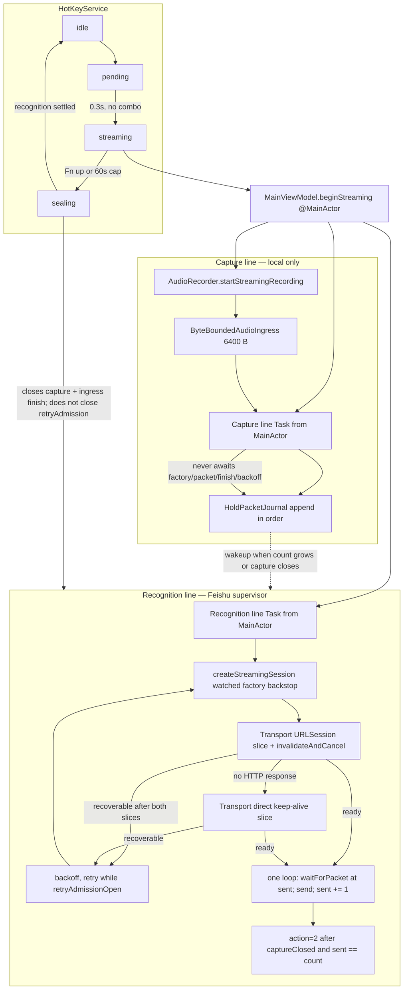
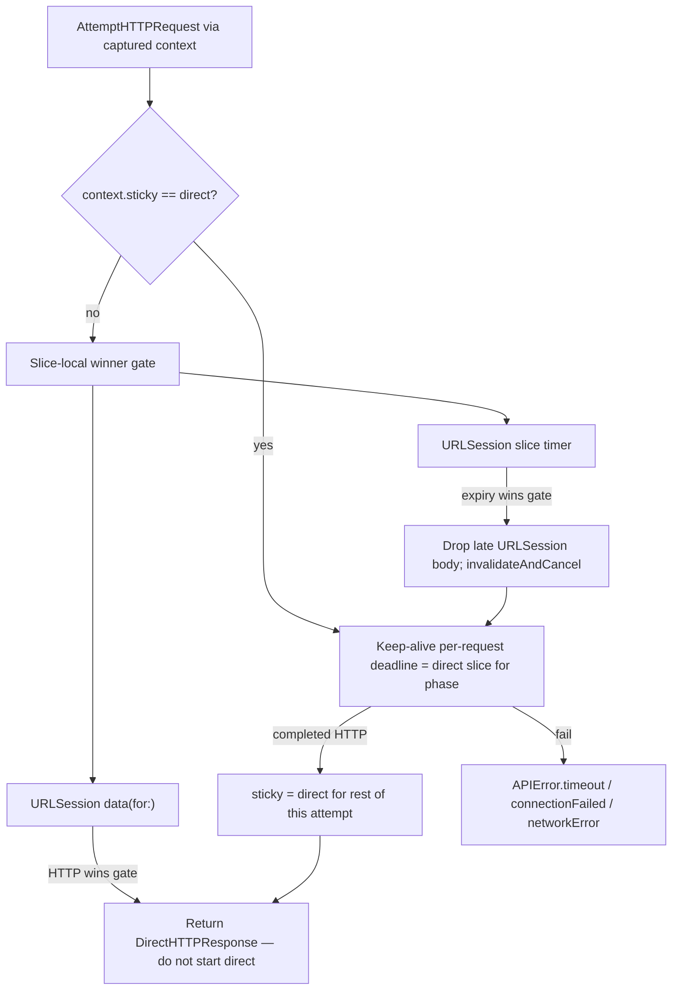

# Capture/Recognition Split and Direct-Connect Fallback for FeishuSpeech

| Field | Value |
|---|---|
| **Document** | Capture line vs recognition supervisor; URLSession hang fail-fast; Network.framework `preferNoProxies` fallback |
| **Author** | (design confirmed by owner 2026-08-20) |
| **Date** | 2026-08-20 |
| **Status** | Confirmed by owner 2026-08-20 |
| **Repo** | FeishuSpeech (`/Users/ylpromax5/Workspace/feishuspeech`) |
| **Issue** | [#28](https://github.com/KaolaBrother/FeishuSpeech/issues/28), [#29](https://github.com/KaolaBrother/FeishuSpeech/issues/29), [#30](https://github.com/KaolaBrother/FeishuSpeech/issues/30), [#31](https://github.com/KaolaBrother/FeishuSpeech/issues/31). Implement in that order. Unclaimed; no workflow run yet. |
| **Not this repo** | KaolaTerminal D-154 / issue #112 is a **reference for ownership split only**. Do not clone its recorder, review UI, or pipelined-hold model. |

---

> **Issue #40 v2 output-routing note.** This issue #28–#31 design predates the current one-route
> review contract. Its capture/recognition/provider ownership split, bounded journal/retry model,
> transport fallback, and no-UI-await/backpressure constraints remain applicable. Statements below
> that retain cursor-bound output or reject a review surface are historical for the output boundary;
> accepted interactions now use the same streaming/sealing/editable draft and explicit Send/Return
> confirmation described in [D-40-01](../decisions/D-40-01.md) and
> [streaming-speech-design.md](../streaming-speech-design.md). This note does not authorize changes
> to the protected async or transport design in this record.

## Overview

Owner report: **"It always stuck if it fails to connect to the server at the beginning."**

Today FeishuSpeech starts the microphone immediately, but the **only** PCM consumer (`MainViewModel.consumeAudio`) waits on `createStreamingSession` — tenant-token HTTP + `FeishuStreamingSession` construction — before it ever reads `ByteBoundedAudioIngress` or appends `packetJournal`. Unread PCM is **not discarded while the generation is alive**: `ByteBoundedAudioIngress` keeps queued packets under one lock until `next()`, and production uses `retainsDeliveredPacketsForReplay: true`. The coupling still hurts: the overlay says listening, no cursor text is written, recognition cannot start replay until factory returns `.ready`, and **generation teardown** (`expirePostReleaseDrain` / `terminateAbnormally`) fails the ingress and drops that unread PCM. A late connect *during* hold or drain can still drain the ingress today; a connect that wins only after teardown cannot.

Some factory classes (`authFailed`, HTTP 400/401, `StreamFailure.cancelled`) tear down **capture as well as recognition**. A clean 30 s coordinator watchdog hang is already recoverable (`.timeout`); the dangerous secondary path is transport `CancellationError` / `URLError.cancelled` mapped to terminal `.cancelled` **while retry is still open**.

This design splits one Fn hold into two concurrent lines after the existing 0.3 s gate:

1. **Capture line (local, never waits on Feishu).** `AudioRecorder` + `ByteBoundedAudioIngress` drain PCM into a generation-scoped packet journal for the whole hold, including while the API is down. Fn release / 60 s cap still close capture only. Both capture and recognition tasks remain unstructured `Task`s started from `@MainActor` `beginStreaming` unless a later PR explicitly moves work off MainActor (this series does not).
2. **Recognition line (supervisor, PR 1).** While the generation retains retry authority (hold + 60 s post-release drain), it retries session factory, journal replay from index 0, live packet send, and action-2 finish. It is the **sole reader of the journal** and **never** holds the ingress iterator.
3. **Transport (PR 3–4).** A hung or proxied system `URLSession` path is cancelled by a **transport-owned slice timer** (`invalidateAndCancel`), then the **same** watched factory/packet/finish operation starts a direct Network.framework slice with TLS SNI `open.feishu.cn` and `preferNoProxies`. A **slice-local winner gate** admits exactly one of completed HTTP, URLSession connect-class/`timedOut`, or timer first (no duplicate `action=1`; `timedOut` and the timer must not both start direct). The coordinator watchdog is a **backstop**, not the slice switch. Direct is a **fallback**, not a replacement of DNS, and **not** a revival of the hardcoded Feishu CDN IP list (issue #3 / D-2-01). Direct does **not** extend one-shot `DirectFeishuHTTPClient.send()` (`Connection: close` + `connection.cancel()` per POST). A **new** attempt-scoped serial HTTP/1.1 keep-alive session carries token + `stream_recognize` POSTs for that attempt.

Owner confirmed this design on **2026-08-20** (Q1-A, Q2-A, Q3 conservative factory-only shrink, Q4-A, Q5-A, D1–D7). Open questions are **Resolved**. GitHub issues #28–#31 are filed (PR 1–4). This document does not start implementation.

---

## Background & Motivation

### Current state (verified against source)

FeishuSpeech is a single-hold macOS 13+ menu-bar app. After `HotKeyService` `idle → pending (0.3 s) → streaming`, `MainViewModel.beginStreaming` (around line 492) starts capture **and** a single `consumerTask` that owns both journal admission and Feishu liveness:

```492:550:FeishuSpeech/ViewModels/MainViewModel.swift
    private func beginStreaming(identity: StreamingSessionIdentity) {
        // ...
        guard startStreamingCapture(identity: identity, ingress: ingress) else {
            failStartup(identity: identity, message: "无法启动录音")
            return
        }
        // ...
        consumerTask = Task(priority: .userInitiated) { [weak self] in
            await self?.consumeAudio(identity: identity, ingress: ingress)
        }
    }
```

`MainViewModel` is `@MainActor` (line 60). That `consumerTask` therefore runs `consumeAudio` on the MainActor; existing `await`s already yield. This design does **not** change that thread model.

`AudioRecorder.publishConvertedAudio` (around line 551) only `ingress.append`s converted 16 kHz Int16 PCM on `bufferQueue`. It never awaits token, factory, or packet send. Capture **start** is not gated on the network.

The stuck-at-start coupling is in `consumeAudio` / `consumePackets`:

```669:837:FeishuSpeech/ViewModels/MainViewModel.swift
    private func consumeAudio(...) async {
        var iterator = ingress.stream.makeAsyncIterator()
        while isActive(identity), !Task.isCancelled {
            switch await createStreamingSession(identity: identity) {
            case .ready(let session, let attemptIdentifier):
                // replayJournal then consumePackets — only after factory returns
            // ...
            }
        }
    }

    private func consumePackets(...) async throws -> Bool {
        while let packet = try await iterator.next() {
            packetJournal.append(packet)   // journaled only here
            // then performSessionOperation → session.sendAudioPacket
        }
    }
```

`createStreamingSession` (around line 693) always goes through `performWatchedOperation` with operation `"factory"`, which calls `SpeechStreamingSessionProviding.makeStreamingSession`. Production implementation:

```533:553:FeishuSpeech/Services/FeishuAPIService.swift
    func makeStreamingSession(appId: String, appSecret: String) async throws -> any SpeechStreamingSession {
        try ensureNetworkAvailable()
        let initialToken = try await getAccessToken(appId: appId, appSecret: appSecret)
        return FeishuStreamingSession(
            initialToken: initialToken,
            refreshToken: { ... },
            requestSender: { request in try await self.sendStreamingRequest(request) }
        )
    }
```

That path is:

1. `ensureNetworkAvailable()` — throws `APIError.networkUnavailable` if `NWPathMonitor` last saw `path.status != .satisfied` (around lines 701–705, 372–384). No TCP is attempted. Coordinator already retries `.networkUnavailable` (`MainViewModel.swift` 1219–1220), so this gate does **not** kill the hold; it **skips sending `app_id` / `app_secret`** until the path is satisfied.
2. `getAccessToken` — cache or `POST /open-apis/auth/v3/tenant_access_token/internal` with JSON `app_id` / `app_secret` (649–658).
3. Construct `FeishuStreamingSession`. The first `stream_recognize` POST happens later, on `sendAudioPacket` with `action=1`.

Production HTTP is `sendRequest` / `sendStreamingRequest` → `executeURLRequest` → **`URLSession.shared.data(for:)`** (around lines 750–762, 691–698, 864–866). `makeURLRequest` (848–861) and `FeishuStreamingSession.makeRequest` (463–487) **do not set `timeoutInterval`**. There is no dedicated `URLSessionConfiguration` and no `invalidateAndCancel` of `.shared`. `URLSessionConfiguration.default` (what `URLSession.shared` uses) already has **`waitsForConnectivity = false`**. The hang ingredients are: no request timeout, implicit 60 s / 7-day session timeouts vs a 30 s watchdog, no way to kill `.shared` at slice expiry, and `ensureNetworkAvailable` skipping TCP. Pinning `waitsForConnectivity = false` on a dedicated session is **hygiene / KaolaTerminal F3 parity**, not the production defect.

`DirectFeishuHTTPClient` still exists (around lines 88–217): `NWConnection` to a raw `ipAddress:443`, TLS SNI via `sec_protocol_options_set_tls_server_name(..., host)` with `host = "open.feishu.cn"`, `.waiting` treated as immediate failure (issue #2), cancellation via `CancelBox` (issue #4), `Connection: close` per call. **`parameters.preferNoProxies` is not set.** Production `sendRequest` never calls `sendDirectRequest`. The only remaining production-visible entry is DEBUG `sendDirectRequestForTesting` (488–507), which still iterates a caller-supplied IP list then URLSession DNS. Hardcoded CDN IPs were a P1 (issue #3); D-2-01 records that the current contract is DNS-first `open.feishu.cn` and that the hard-coded IP path is historical.

Coordinator watchdogs: `StreamingDrainPolicy.operationTimeoutNanoseconds` defaults to **30 s** for factory, packet, **and** finish (`StreamingSpeechModels.swift` 33–51). Post-release drain is **60 s**. Retry backoff is `StreamingRetryPolicy`: 250 ms base, doubling, 4 s cap, jitter 0.8–1.2, 200 ms minimum (`StreamingSpeechModels.swift` 13–30; `MainViewModel` init around 338–341). Recoverable vs terminal tables live in `isRecoverable` (`MainViewModel.swift` 1209–1238).

Cancel mapping today (several sites, not one):

| Site | Today |
|---|---|
| `performWatchedOperation` timeout win (`1109–1135`) | yields `.timeout` (recoverable), then `task.cancel()` |
| `streamFailure(for:)` (`1138–1144`) | `CancellationError` → `.cancelled` (terminal) |
| `performWatchedOperation` `result ?? .failure(.cancelled)` (`1130–1135`) | no yield (parent/admission cancel) → `.cancelled` |
| `performSessionOperation` admission guard (`1005–1007`) | `!retryAdmissionOpen` or not current attempt → throws `.cancelled` (**must stay terminal**) |
| `FeishuStreamingSession.sanitizedFailure` (`578–595`) | `CancellationError` **and** `URLError.cancelled` → `.cancelled`; other `URLError` → `.timeout` / `.network`; **non-URLError (including `NWError`) → `.network`** |
| Coordinator `streamFailure(for:)` unclassified | non-`StreamFailure` / non-`CancellationError` / non-`APIError` → `.malformedResponse` (**terminal**). Factory path does **not** go through `sanitizedFailure`. A raw `NWError` from `DirectFeishuHTTPClient.send()` on **token/factory** therefore becomes unclassified → terminal. Packet path through `FeishuStreamingSession` would map `NWError` to `.network`. |

Tests pin `("cancelled", .cancelled)` as hold-terminal (`StreamingMainViewModelTests.swift` 2909–2956) and `("unclassified", ReviewUnclassifiedError())` as factory-terminal (2863–2876).

`HotKeyService.handleFnPressed` ignores a new Fn press while `.sealing` (around line 329). Architecture (`docs/architecture.md`) and D-25-01 state a new hold cannot start while sealing.

Overlay is status-only (`RecordingOverlayView` shows `status.text` only). `.streaming` is `"正在聆听…"`. `MenuBarView` also shows `viewModel.status.text` (line 40). `OverlayWindowController` panel is `280×100` (line 30). Recoverable retry does not change overlay (`docs/api.md` lines 43–46). `overlayMessage` is completion-feedback-only (`publishCompletionFeedback`).

### Pain

| Symptom | Mechanism |
|---|---|
| Stuck at the beginning of a hold (primary) | Factory (path-monitor gate + token POST via `URLSession.shared`) must return `.ready` before `packetJournal.append` and before recognition sends. A VPN/proxy black-hole parks `data(for:)`. Ingress **retains** unread PCM while the generation lives; journal stays empty; overlay still `.streaming`; no cursor text. |
| Drain expires with unused audio | If factory never returns `.ready` before `expirePostReleaseDrain` (`MainViewModel.swift` 1973–2015), teardown fails the ingress and reports `"流式识别失败"` when `outputPreservationState == .none`. PCM that sat in ingress is then gone. A factory `.ready` **during** hold or drain can still drain ingress today. |
| Secondary: transport cancel mapped as hold cancel | A **clean** 30 s watchdog hang already yields `.timeout` (recoverable). What **does** kill the hold: `URLError.cancelled` / `CancellationError` from proxy reset or attempt cancel **while `retryAdmissionOpen`**, mapped to `StreamFailure.cancelled`; factory `NWError` / unclassified → `.malformedResponse`; completed HTTP 400/401 / 407 / 403 / 200-HTML. |
| Path-monitor lie | A VPN tunnel can be `.satisfied` while Feishu is black-holed, or `.unsatisfied` during `utun` transition. The latter throws `networkUnavailable` **before any TCP** (skips credential send; coordinator retries). |
| Direct-IP unused | The only code that can bypass HTTP/SOCKS proxy (`DirectFeishuHTTPClient`) is not on the production auth or `stream_recognize` path. One-shot `Connection: close` would also be the wrong production fallback (300 TLS handshakes). |

### Why KaolaTerminal is a reference, not a port

KaolaTerminal issue #112 / **D-154** (`/Users/ylpromax5/Workspace/kaolaterminal/docs/DECISIONS.md`) split a physical capture producer from a recognition supervisor: microphone callbacks do bounded local work and never await factory/packet/finish/network/backoff. Factory/packet/finish/no-PCM production deadlines are 15 s / 5 s / 45 s / 5 s. Issue #103 F3 set `URLSessionConfiguration.waitsForConnectivity = false` **after it had been true** so a dead network failed into retry instead of parking (`FeishuSpeechRecognizer.makeDefaultSessionConfiguration()`).

FeishuSpeech’s `URLSession.shared` already defaults `waitsForConnectivity` to false. Port the **ownership split** and the **dedicated-session + fail-fast** idea. Do not treat `waitsForConnectivity = false` as the bug, and do not clone the iOS recorder, review/draft/`发送` UI, pipelined overlapping holds (D-145), sticky-incomplete banner, or “never replay ACKed PCM” ledger rule.

---

## Goals & Non-Goals

### Goals

- Recording/capture remains live for the current hold even when Feishu is unreachable at hold start.
- The capture line is the sole ingress consumer and does not await factory. Every drained PCM packet is journaled in capture order; the journal is the only recognition input.
- Recognition retries connecting to Feishu for as long as the generation has retry authority (hold + 60 s post-release drain). Retry is still unbounded except by those deadlines.
- **Connect-class / no-HTTP-response** factory failures are not hold-terminal. Completed credential rejection (`HTTP 200` + `AuthResponse.code != 0` → `authFailed`) stays terminal. Other completed HTTP statuses follow **today’s coordinator deny/allow list** (**Q5-A confirmed**).
- When the system `URLSession` path **hangs or fails without a completed HTTP response**, fall back to Network.framework with TLS SNI `open.feishu.cn` and `preferNoProxies = true`, using an **attempt-scoped keep-alive** connection. Apply that fallback to **both** tenant-token fetch and `stream_recognize` POSTs on the streaming path only.
- Preserve issue #27 cursor-writing trust boundary, overlay-as-status-only, no whole-file fallback, no parallel request chain, coordinator-owned retry, 6,400 / 3,200 / 1,920,000 ingress contract, 0.3 s Fn gate, 60 s capture cap.

### Non-Goals

- Overlapping / pipelined holds (KaolaTerminal D-145). **Rejected (Q4-A / D7).**
- Restoring a hardcoded Feishu CDN IP allowlist (issue #3).
- Silently binding sockets to `en0` to skip a TUN VPN (traffic leakage). **Rejected (Q2-A).**
- Changing Feishu packet size, action/sequence contract, or `10024` meaning (still unknown; still recoverable).
- Importing KaolaTerminal review/preview/draft/`发送`/`撤回` UI.
- Changing Keychain credential storage, AX range replacement, or `CurrentFocusAppendSession`.
- Unifying `APIError.isRetriable` with coordinator `isRecoverable` as a silent drive-by (legacy whole-file `withRetry` is out of production Fn path).
- Wrapping legacy `recognizeSpeech` / `file_recognize` `sendRequest` in the streaming transport context.
- Custom TLS `sec_protocol_options_set_verify_block`, trust-all, ATS disable, or CDN cert pin.
- Moving capture/recognition tasks off `@MainActor` in this series.
- Implementing this change in this document.

### Explicitly not ported from KaolaTerminal

| KaolaTerminal (D-154 / D-145 / speech UI) | FeishuSpeech |
|---|---|
| iOS `AVAudioEngine` / `PCM16AudioRecorder` | Keep macOS `AVCaptureSession` `AudioRecorder` |
| 55 s / 1,766,400-byte ledger; drop oldest queued under pressure | Keep 60 s / 1,920,000-byte cap; overflow is **terminal** (`AudioIngressError.ingressOverflow`) |
| Fresh attempt replays only the current unacked packet; ACKed PCM never replayed | Keep **full journal replay from index 0** on a fresh `FeishuStreamingSession` (new stream has no ASR memory). Output ownership stays journal-index based (already-owned indices never own output again). |
| Sticky incomplete `"Voice review may be incomplete."` | No review surface. Drain expiry already distinguishes committed / uncertain / none. |
| Preview / review / draft / explicit `发送` | Keep cursor-bound AX / current-focus keyboard from #26/#27 |
| Pipelined capture-while-recognizing (D-145) | Keep single-hold; sealing blocks a new Fn press (**Q4-A confirmed**) |
| no-PCM 5 s heartbeat + recorder lease / global physical-owner quarantine | Out of scope. macOS recorder already fail-stops on device/runtime/conversion (`docs/architecture.md` AudioRecorder section). |
| Empty-ACK rotation | Stay disabled / not imported |
| `VoiceDiagnosticsLog` schema | Keep existing `os.log` privacy rules |

---

## Proposed Design

### 1. Two concurrent lines after a hold starts



Capture and recognition share: `StreamingSessionIdentity` (generation), `retryAdmissionOpen`, `captureClosed`, `postReleaseDrainDeadline`, `HoldPacketJournal`, `ResponseOutputLedger`, overlay/status. They do **not** share a wait.

`ByteBoundedAudioIngress.stream` remains a **single-consumer** `AsyncThrowingStream`. Today that consumer is `consumeAudio`, which also owns factory. After PR 1, **only the capture line** iterates the ingress stream. The recognition line never holds that iterator.

Both tasks are unstructured `Task`s created from `beginStreaming` on `@MainActor`, same as today’s `consumerTask`. A lock-backed journal is enough for capture-append vs recognition-wait. This series does **not** declare those tasks `nonisolated` or move PCM wait/send off MainActor. `handleStreamingEvent` stays on MainActor.

### 2. Today's coupled consumeAudio/factory loop

```mermaid
sequenceDiagram
    participant Fn as HotKeyService
    participant VM as MainViewModel
    participant Rec as AudioRecorder
    participant Ing as ByteBoundedAudioIngress
    participant Fac as FeishuAPIService.makeStreamingSession
    participant US as URLSession.shared

    Fn->>VM: streaming(identity)
    VM->>Rec: startStreamingRecording(ingress)
    Rec->>Ing: append PCM on audioQueue (local)
    VM->>Fac: consumeAudio awaits createStreamingSession
    Fac->>Fac: ensureNetworkAvailable (path-monitor)
    Fac->>US: getAccessToken POST (no request timeout, no invalidateAndCancel)
    Note over Ing,US: PCM queues in ingress (retained). packetJournal empty. overlay = 正在聆听…
    US--xFac: hang / proxy fail / 30s watchdog
    alt recoverable .timeout
        Fac-->>VM: failure → backoff → factory again
        Note over VM,Ing: still not reading ingress; PCM still in ingress until teardown
    else URLError.cancelled / auth / HTTP 400 / unclassified NWError
        VM->>Rec: terminateAbnormally + forceCleanup
        Note over Rec: capture dies with recognition; ingress failed
    end
    Fn->>VM: sealing (Fn up)
    Note over VM: 60s drain retries factory; ingress still holds PCM if generation alive
```

### 3. Proposed two-line hold

```mermaid
sequenceDiagram
    participant Fn as HotKeyService
    participant VM as MainViewModel
    participant Cap as Capture line
    participant J as HoldPacketJournal
    participant Recog as Recognition line
    participant Ctx as TransportAttemptContext
    participant US as Per-attempt URLSession
    participant NW as Attempt keep-alive NWConnection

    Fn->>VM: streaming(identity)
    VM->>Cap: start recorder + drain ingress
    Cap->>J: append every 6400 B packet
    par Recognition independent of capture
        Recog->>Ctx: makeStreamingSession creates context
        Ctx->>US: factory URLSession slice
        Note over US: slice timer invalidateAndCancel — not the coordinator watchdog
        alt URLSession no HTTP response
            US--xCtx: connect-class / timeout
            Ctx->>NW: same POST, SNI open.feishu.cn, preferNoProxies, keep-alive
        end
        alt still recoverable
            Recog->>Recog: backoff, retry while retryAdmissionOpen
        else ready
            Recog->>J: one loop from sent=0; never wait at 0 after packets already sent
            Recog->>VM: handleStreamingEvent on MainActor (unchanged #27)
        end
    end
    Fn->>VM: sealing
    VM->>Cap: stop recorder, barrier, ingress.finish, captureClosed
    Note over Recog: still retries factory/replay/finish until drain or action-2
```

### 4. Capture line (PR 1)

**Owner.** A generation-scoped unstructured `Task` started from `beginStreaming` (MainActor, same as today’s `consumerTask`), plus the existing `AudioRecorder` / `ByteBoundedAudioIngress` pair.

**Allowed work.** Converted PCM → `ingress.append` (already on `audioQueue` / `bufferQueue`) → capture task `iterator.next()` → `HoldPacketJournal.append`. Wake the recognition waiter.

**Journal complete vs fail (required).** `markCaptureComplete()` runs **only** after a successful `ingress.finish` on the recorder-barrier path (`AudioRecorder` barrier + tail pad). If `iterator.next()` throws (`.cancelled`, `.captureFailed`, overflow) or teardown calls `ingress.fail`, the capture task calls `cancelWaiters()` and **returns**. It must **not** `markCaptureComplete()`. Recognition must not send action=2 while `terminateAbnormally` is tearing the hold down. `finishConsumedAudio`’s existing `captureClosed` guard remains a second belt (`MainViewModel.swift` 882–884). On `ingressOverflow` / recorder `failure`, take the existing terminal capture path (`handleAudioRecorderFailure` / overflow abort). That path already stops the hold; it is not a Feishu liveness failure.

**Forbidden work.** `makeStreamingSession`, `getAccessToken`, `sendAudioPacket`, `finish`, `session.cancel` except as part of generation teardown already owned by `terminateAbnormally`, backoff sleep, transport fallback. No `Task` per audio callback (KaolaTerminal D-154 constraint; FeishuSpeech already satisfies this — `publishConvertedAudio` is synchronous under `bufferQueue`).

**Ingress constants — unchanged.**

```14:18:FeishuSpeech/ViewModels/MainViewModel.swift
private let streamingIngressConfiguration = AudioIngressConfiguration(
    packetByteCount: 6_400,
    minimumTailByteCount: 3_200,
    maximumBufferedByteCount: 1_920_000
)
```

Production still uses `retainsDeliveredPacketsForReplay: true`. Occupancy is `retainedDeliveredByteCount + bufferedByteCount + pendingAudio.count` (`ByteBoundedAudioIngress.swift` 179–180). After PR 1 the capture line dequeues promptly, so **queued** bytes stay small, but **retained delivered** still grows to 1,920,000 and `HoldPacketJournal` holds another copy. Peak PCM memory is therefore **~2×** (ingress retain + journal). **Do not** set `retainsDeliveredPacketsForReplay` false in this series unless the journal becomes the sole byte cap and tests move with it. Overflow still works **because** occupancy includes retained delivered; overflow remains terminal; packets are never dropped, reordered, or merged. Overflow during a factory hang still terminals (cap unchanged). The journal is the recognition replay source; ingress retain is the capture byte cap.

**Fn release / 60 s cap.** `beginSealing` (`MainViewModel.swift` 1902+) already sets `captureClosed = true`, overlay `.sealing` `"正在完成识别…"`, stops the duration timer, and runs the recorder barrier + tail pad + `ingress.finish`. It must **not** start waiting on factory. Recognition authority stays open (`retryAdmissionOpen`) until action-2, drain expiry, or terminal failure.

### 5. HoldPacketJournal (new, lock-backed) — PR 1

Today `packetJournal: [Data]` is a `MainViewModel` stored property mutated only on the MainActor inside `consumePackets`. Capture drain wants to append without waiting on recognition, and recognition wants to wait without holding the ingress iterator.

Introduce a small `nonisolated` lock-backed journal (same style as `ByteBoundedAudioIngress.Storage`, not a new actor unless contention requires it):

```swift
nonisolated enum JournalWaitResult: Sendable {
    case packet(index: Int, data: Data)
    case captureComplete
    case cancelled
}

nonisolated final class HoldPacketJournal: @unchecked Sendable {
    func append(_ packet: Data)
    func markCaptureComplete()
    func cancelWaiters()
    var count: Int { get }
    func packet(at index: Int) -> Data?
    func waitForPacket(atOrAfter index: Int) async -> JournalWaitResult
}
```

**`waitForPacket(atOrAfter:)` priority under one lock** (same order as ingress `registerNext`, `ByteBoundedAudioIngress.swift` 232–249: queued bytes before terminal nil):

1. If `count > index` → return `.packet` for that index **even when capture is already marked complete**.
2. Else if capture is complete → return `.captureComplete` (this implies `index >= count`).
3. Else park until append, complete, or cancel.

Do **not** return sticky `.captureComplete` while unread packets remain. The waiter can be parked at `sent == count - 1` while `markCaptureComplete()` runs after the last `append` under a later lock acquisition; step 1 still yields the tail packet.

Rules:

- Append is capture-order, 6,400-byte elements as emitted by ingress (plus one padded tail).
- Recognition **fresh attempt** sends journal packets in order from index 0 in **one** loop (`sent` = packets actually sent on this attempt). Do **not** replay a snapshot then wait at 0. This is the current contract’s *order* (`replayJournal` around line 841; `docs/api.md` “serially replays the journal from index 0”), not two walks of the same indices. Do **not** adopt KaolaTerminal’s “never replay ACKed PCM”: a new `FeishuStreamingSession` has a new `stream_id` and must hear the utterance from `action=1`.
- `ResponseOutputLedger` still keys output by journal index. Replay of an already-owned index must not write again.
- Waiters cancel on generation invalidate / `closeRetryAdmission`.
- Memory bound: journal ≤ 1,920,000 captured bytes (300 × 6,400 plus one 3,200 tail). Ingress retain-true still tracks the same captured-byte cap (unchanged). Peak PCM is ~2× those copies. Disconnected recording cannot grow past the existing cap.

**PR 1 value (precise):** sole ingress consumer no longer awaits factory; journal is the only recognition input; two replay sources (ingress queue vs journal) are not left racing. Teardown/overflow no longer hide PCM that recognition could have replayed **if** factory wins before drain expiry — because that PCM is already journaled. “Spoke while disconnected, then connected, nothing to replay” is **false** today if connect happens while `retryAdmissionOpen` (ingress still holds it); it is **true** if connect happens after teardown. PR 1 makes reconnect-during-drain use the journal even if the recognition loop was sitting in factory at Fn-up.

### 6. Recognition line (the supervisor split is PR 1)

PR 1 **replaces** the body of `consumeAudio`: recognition no longer iterates ingress. PR 2 does **not** rewrite this loop; it only changes cancel/terminal classification. Overlay/menu strings stay `"正在聆听…"` / `"正在完成识别…"` (**Q1-A**).

**One send loop. Do not resend after a named replay.** Today `replayJournal` walks the array and `consumePackets` continues the **ingress iterator**, which does not re-yield dequeued packets (`MainViewModel.swift` 773–785, 803–811, 841–848). After PR 1 the journal is the only input. A loop that snapshots `replay journal[0 ..< count]` and then `wait`s at `sent = 0` **re-POSTs every packet**, including a second `action=1`. That violates Decision 16.

Collapse to **one** loop. `sent` is the count of packets **actually sent** on this attempt (including packets appended while an earlier send was in flight). Never wait at 0 after a non-empty prefix has already been sent.

```text
while isActive(identity) && retryAdmissionOpen && !Task.isCancelled:
    outcome = createStreamingSession(...)   // watched factory (outer backstop)
    switch outcome:
      stop: return
      retry: continue
      ready(session, attempt):
        sent = 0
        loop:
          wait = waitForPacket(atOrAfter: sent)  // packet-before-complete under one lock
          switch wait:
            packet(index, data):
              // index == sent; send once (action=1 iff sent == 0)
              sendAudioPacket (watched "packet"); sent += 1
            captureComplete:
              // only when sent == count; tail already sent if it existed
              break loop
            cancelled:
              return
        if captureClosed && sent == journal.count:
            finishConsumedAudio (watched "finish")   // action=2 once
            return or retry
        on recoverable failure: cancelCurrentAttemptOnce; waitForRetryIfAdmitted; break to factory
        on terminal failure: handleStreamingFailure (invalidates generation → capture teardown)
```

If a named “replay” phase is kept for logs (`streamingAttemptPhase = .replayingJournal` while `sent < snapshotAtReady`), it is **display only**. Sends still go through the same loop; `sent` includes every packet actually POSTed. Do **not** start a second walk at 0.

Still true after the split:

- Coordinator, not `FeishuStreamingSession`, owns retry.
- At most one live `FeishuStreamingSession` per hold.
- No whole-file `file_recognize` fallback.
- No parallel request chain.
- Successful packet ACK (including replay ACK) resets `retryFailureStreak` to 0 (`recordPacketAcknowledgement`, line 1162).
- Finish still requires `captureClosed` (`finishConsumedAudio` around 882–884). `markCaptureComplete()` is **not** a substitute: it fires only after successful `ingress.finish`. If the capture line’s iterator throws, `cancelWaiters()` and do **not** finish the Feishu stream. If the iterator ends without `captureClosed`, keep the existing `"音频流意外结束"` terminal path.
- `handleStreamingEvent` / cursor writers remain `@MainActor` and generation-guarded.

### 7. Recoverable vs terminal

Keep **two tables**; do not silently unify them.

| Surface | File | `networkUnavailable` | HTTP 400/401 | `CancellationError` |
|---|---|---|---|---|
| Legacy whole-file `APIError.isRetriable` | `FeishuAPIService.swift` 896–905 | **false** | **true** (and token cache cleared on speech 400/401) | rethrown, not retried (`withRetry` 599–600) |
| Streaming coordinator `isRecoverable` | `MainViewModel.swift` 1209–1238 | **true** | **false** (except 408/425/429/5xx) | mapped to `.cancelled`, **false** |

Production Fn uses only the coordinator table. Leave `isRetriable` as the whole-file compatibility contract.

#### 7.1 Two-row cancel table (must land in code and tests)

| Row | Predicate | Map to | Recoverable? |
|---|---|---|---|
| **Attempt-cancel** | `retryAdmissionOpen && isCurrentAttempt` | `StreamFailure.timeout` (or `APIError.timeout` before `streamFailure`) | **yes** |
| **Generation-cancel** | `closeRetryAdmission` already ran, identity invalidated, `HotKeyState.cancelled`, sleep/wake, reset, secure-input fail, or `performSessionOperation` admission guard `!retryAdmissionOpen` | `StreamFailure.cancelled` | **no** |

Apply the attempt-cancel row to **all** of these throw sites when the predicate holds:

- `CancellationError`
- `URLError.cancelled` (including via `FeishuStreamingSession.sanitizedFailure`)
- `StreamFailure.cancelled` that originated from **transport** cancel (session `invalidateAndCancel`, slice timer, `CancelBox`, `URLSession` task cancel) — **not** from the admission guard after `closeRetryAdmission`
- `streamFailure(for:)`
- `performWatchedOperation` `result ?? .failure(.cancelled)` when the stream finished without a yield **but** retry is still open and the attempt is current (treat as timeout). If retry is already closed, keep `.cancelled`.

Do **not** flatten `performSessionOperation`’s admission guard (`MainViewModel.swift` 1005–1007) into timeout: that throw means generation teardown and **must stay** `.cancelled`.

Later tests must split today’s `("cancelled", .cancelled)` deny list into these two rows. A clean coordinator watchdog timeout remains `.timeout` as it is today; that is **not** the primary stuck-at-start bug.

#### 7.2 Factory terminal set — no silent 400/401 flip

**Keep today’s coordinator HTTP deny/allow list (Q5-A / D1 / D3 / D4 confirmed).** Do not treat unparseable HTTP 400/401 as recoverable while leaving 407/403/200-HTML terminal.

| Outcome | Today | This design (v1 default) |
|---|---|---|
| Hang / `URLError` connect/proxy/DNS / no HTTP response | recoverable, no direct | recoverable + **direct fallback** (PR 4) |
| Direct `.waiting` / `.failed` / `NWError` / POSIX | unused in production; raw `NWError` on factory would be unclassified → terminal | mapped to `APIError.timeout` / `.connectionFailed` / `.networkError` **before** `streamFailure`; recoverable connect-class |
| HTTP 408 / 425 / 429 / 5xx | recoverable, URLSession retry | recoverable; **no** hop to direct (completed HTTP). **Q5-A:** no hop on completed HTTP |
| HTTP 407 / 403 | terminal | **still terminal, no fallback** (v1). Capture still lives after PR 1+2; PR 4 does not apply. UAT with a 407 proxy is expected to fail recognition |
| HTTP 400/401 parseable Feishu auth / speech | terminal (`httpError` / `authFailed` / `.authentication`) | **still terminal**. Wrong credentials stay `认证失败，请检查应用凭据` |
| HTTP 400/401 **unparseable** body | factory terminal (`httpError(400/401)` denied in tests) | **still terminal (Q5-A / D4)** |
| HTTP 200 + HTML/captive (`AuthResponse` needs `code` and `msg`, `SpeechResult.swift` 18–19 → `DecodingError` → `.malformedResponse`) | terminal | **still terminal**. Owner-visible residual: **captive/proxy 200 HTML still ends the hold as `流式识别失败` / malformed, not as reconnect** |
| HTTP 200 + `AuthResponse.code != 0` | `APIError.authFailed` (`getAccessToken` 667–672) terminal | still terminal. Correct |

`FeishuStreamingSession` known-invalid-token one-shot refresh (business code `99991663` on bounded HTTP 400/401) is unchanged.

#### 7.3 Single transport error mapping (URLSession and NW)

One function used by both the dedicated `URLSession` path and `DirectFeishuKeepAliveSession`, **inside `FeishuAPIService`**, before any error reaches `streamFailure(for:)` or `sanitizedFailure`:

```text
if the call produced a completed HTTP response (status + body, even 4xx/5xx):
    return DirectHTTPResponse  // never invent APIError from NWError
else if timeout / slice timer / URLError.timedOut / POSIX ETIMEDOUT:
    throw APIError.timeout
else:  // URLError connect/proxy/DNS, NWError, POSIX, .waiting, .failed, no response
    throw APIError.connectionFailed or APIError.networkError
```

**Never** let `NWError` reach `streamFailure(for:)`. Direct `.waiting` is recoverable connect-class, not unclassified and not `.cancelled`. Historical `sendDirectRequest` already collapsed leftover errors to `APIError.connectionFailed` (832–836); production fallback must do the equivalent without resurrecting the IP loop.

`sanitizedFailure` remains a second line of defense on the packet actor: `URLError.cancelled` becomes `.cancelled` there today and **must** then hit the two-row table in the coordinator (attempt-cancel → timeout). Prefer converting at the `RequestSender` so the actor mostly sees `APIError` or `DirectHTTPResponse`.

#### 7.4 Path monitor — hint, not a factory gate (owner-visible default D2)

Remove `ensureNetworkAvailable()` from `makeStreamingSession`, `sendStreamingRequest`, and `refreshStreamingAccessToken` (PR 3). Whole-file `recognizeSpeech` may keep the gate.

**Owner-visible residual:** streaming will attempt the tenant-token POST even when `NWPathMonitor` is unsatisfied (captive / `utun` flip). App Secret rides that HTTPS request. We will **not** send it if TLS to `open.feishu.cn` fails. Implementation must keep SNI + **default peer authentication required** on **both** URLSession and `NWConnection` (ATS does not automatically bind Network.framework the same way as URLSession). No custom verify block.

Keep `NWPathMonitor` for: log unsatisfied; clear token cache on unsatisfied → satisfied (existing `handleNetworkChange` 372–384). `resetStateForWake` still forces `isNetworkAvailable = true`.

### 8. Deadlines and transport-owned slices

**Coordinator watchdogs are backstops.** They must **not** be the URLSession → direct switch. If the only cancel is `performWatchedOperation`’s outer timer, a hung `data(for:)` occupies the entire factory budget and **direct never starts**. PAC resolution and CONNECT can stall **before** `timeoutIntervalForRequest` starts; `timeoutInterval` alone is not sufficient. The transport owns a **slice timer**: at URLSession-slice expiry it `invalidateAndCancel()`s that attempt session, maps the outcome as connect-class / no-response, then starts the direct slice **inside the same watched factory/packet/finish operation**.

Slice lengths live on `StreamingDrainPolicy` (single source of truth for coordinator **and** transport). `FeishuAPIService` is constructed with that policy (production `shared` uses the same defaults as `MainViewModel`). Do not hardcode 8/7/3/2 inside the service. Locked production defaults are factory 8+7+1 < 18, packet 14+14+1 < 30, finish 15+15+1 < 45. Tests inject matching policies. `SpeechStreamingSessionProviding` stays unchanged; the service reads its stored policy.

**Slack invariant (required).** `urlSessionSlice + directSlice + slack < outer` with **slack ≥ 500 ms–1 s** (examples use **1 s**). Equality (`8+7=15`, `15+15=30`) is **forbidden**: `performWatchedOperation`’s outer timer (`MainViewModel.swift` 1109–1135) runs for the full backstop in parallel with both slices. On a hung URLSession that consumes its whole slice, direct HTTP can complete in the same millisecond the outer gate claims `.timeout`, cancelling a successful token/`action=1`. Scheduling, XOR, TLS, and MainActor hops need a real gap.

**Locked (owner 2026-08-20, Q3 conservative):** shrink **factory only**. Factory outer **18 s** so **8+7+1 s < 18 s**. Packet outer stays **30 s** (within the 15–30 s UAT band; do **not** use a 5 s packet timeout). Finish **min(remaining drain, 45 s)** with **15+15+1 s < 45 s**. Drain **60 s**, capture **60 s**. `StreamingDrainPolicy.init` **preconditions** `urlSession + direct + slack < outer` so illegal defaults cannot ship.

| Operation | Today | **Locked** | Slice split (on the policy object) |
|---|---|---|---|
| Factory (token + session construct) | 30 s watchdog | **18 s backstop** | **8 s URLSession + 7 s direct + 1 s slack < 18 s**. **Not** 8+7=15, 8+7+1=16, or 15+15=30 |
| Packet (`action=1/0`) | 30 s | **30 s backstop** until UAT (15–30 s band; **not** 5 s) | **14 s URLSession + 14 s direct + 1 s slack < 30 s**. After sticky-direct, packets skip the URLSession slice; still apply `directPacketSlice` as the **per-request** deadline. Direct-slice expiry **invalidates** the keep-alive (§9.3) |
| Finish (`action=2`) | 30 s, clamped to remaining drain | **min(remaining drain, 45 s) backstop** | **15 s URLSession + 15 s direct + 1 s slack < 45 s**. If already sticky-direct, **skip** the URLSession finish slice; still apply `directFinishSlice` as the per-request deadline |
| Post-release drain | 60 s | **60 s unchanged** | |
| Capture cap | 60 s / 1,920,000 B | unchanged | |
| Abort `action=3` | 1 s total | unchanged | 1 s; not a finish/packet slice. **May no-op** if `context.invalidate()` already ran (§12) |

Backoff stays 250 ms → 4 s cap + jitter. Consecutive-failure streak still resets on packet ACK.

**URLSession timeouts (split request vs resource):**

- Per-attempt session is built **once** at `makeStreamingSession`.
- `timeoutIntervalForResource` ≥ `max(urlSessionFactorySlice, urlSessionPacketSlice, urlSessionFinishSlice)` (or the matching **outer** backstop). This is a session-configuration property and is **not** overridden by `URLRequest.timeoutInterval`.
- `timeoutIntervalForRequest` on the configuration may use that same max; it is not the phase bound.
- `URLRequest.timeoutInterval` **and** the transport slice timer equal the **phase** URLSession slice (factory vs packet vs finish).
- Do **not** call `makeStreamingSessionConfiguration(timeout: factorySlice)` and reuse that session for finish (finish would die at the factory 8 s resource timer).

They do **not** replace the slice timer + `invalidateAndCancel`.

**Residual (do not invent a second drain channel):** slices are **not** drain-clamped. Coordinator already clamps the **outer** watchdog to remaining drain (`StreamingDrainPolicy.operationTimeout(remainingDrainNanoseconds:)` today; `performWatchedOperation` 1064–1068). `makeStreamingSession(appId:appSecret:)` cannot receive remaining budget (`SpeechStreamingSessionProviding` unchanged). After Fn-up, if remaining drain is 8 s and `urlSessionFactorySlice` is 15 s, the **outer** backstop cancels first and direct still never starts **inside that operation** — the original hang-switch bug, limited to the drain tail. Hold-start (`remainingDrainNanoseconds() == nil`) is unaffected. The next admitted factory retry (if any budget remains) starts URLSession again. Do **not** pass remaining drain onto the `FeishuAPIService` singleton actor. Do **not** clamp slices from `URLRequest.timeoutInterval` set by the coordinator unless that value is actually passed in (it is not, protocol unchanged).

### 9. Transport attempt context, dedicated URLSession, then keep-alive direct

#### 9.1 `TransportAttemptContext` (implementable contract)

Created at `FeishuAPIService.makeStreamingSession`, one per recognition attempt (monotonic `attemptIdentifier` already exists on the coordinator). Holds:

- a **per-attempt** `URLSession` built **once** from `makeStreamingSessionConfiguration(resourceTimeout:)` where `timeoutIntervalForResource` (and optional configuration `timeoutIntervalForRequest`) ≥ `max(urlSessionFactorySlice, urlSessionPacketSlice, urlSessionFinishSlice)` — **not** the factory slice alone
- slice durations copied from `StreamingDrainPolicy` (**factory, packet, and finish** — both URLSession and direct)
- sticky flag (`urlSession` / `direct`)
- optional `DirectFeishuKeepAliveSession` (new type, §9.3) once sticky-direct
- invalidation: `URLSession.invalidateAndCancel()`, keep-alive `forceCancel` / `CancelBox`, clear sticky

Phase bounds are **not** the session resource timeout. Each POST sets `URLRequest.timeoutInterval` and the transport slice timer to the **phase** URLSession slice.

The `FeishuStreamingSession` `requestSender` closure **captures this context**. There is **no** singleton `currentContext` slot on `FeishuAPIService`. Sticky cannot live as an unkeyed actor field — that would leak across holds.

**Who calls `context.invalidate()`:** `MainViewModel` only holds `any SpeechStreamingSession` (`cancel()` at `StreamingSpeechProvider.swift:12`). The unchanged provider protocol exposes no context handle. Therefore:

- `FeishuStreamingSession.cancel()` **must** call `context.invalidate()` **first** (coordinator already `await session.cancel()` via `cancelCurrentAttemptOnce`). Best-effort `action=3` **may no-op** if the context is already dead; do **not** delay invalidate for abort (§12).
- If `makeStreamingSession` fails **before** returning a session (token POST throws), that method’s `defer` / failure path **must** call `context.invalidate()` so a hung per-attempt `URLSession` is not leaked.
- Direct-slice expiry / parse/send failure on the keep-alive **also** `context.invalidate()`s (§9.3) so the socket is not reused.
- Do **not** add a singleton current-context slot. Prefer **zero** retained contexts on the actor besides the captured closure. `resetState` / `resetStateForWake` should not need to hunt a current slot; they only invalidate if a test/DEBUG retained one, which production must not.

Legacy `recognizeSpeech` / `file_recognize` keeps a **separate** `executeURLRequest` on `URLSession.shared` (or a non-attempt session) **without** this context and **without** direct fallback. Do not wrap the shared `sendRequest` used by `file_recognize` in the streaming fallback.

**All streaming tenant-token POSTs use the live context.** Today `refreshStreamingAccessToken` → `getAccessToken` → `sendRequest` → `executeURLRequest` (`FeishuAPIService.swift` 681–689, 641–658, 750–762) is **not** `requestSender`. After sticky-direct, a `99991663` one-shot refresh (`FeishuStreamingSession.sendWithInitialTokenRefreshIfNeeded` 353–361) would POST App Secret on `URLSession.shared` and re-enter the hanging proxy. Required: factory `makeStreamingSession` **and** `refreshStreamingAccessToken` POST through the live `TransportAttemptContext` as `AttemptHTTPPhase.factoryToken`, honoring sticky-direct and factory slices. Keep `cachedToken` / `tokenExpiry` updates on that path. Whole-file `recognizeSpeech` stays on separate `sendRequest`.

**Phase is not inferred from the coordinator.** `SpeechStreamingSessionProviding` stays unchanged, so `FeishuStreamingSession` must pass **action** into the sender via a thin wrapper around `URLRequest` (not a provider-protocol change). Token fetch (factory and mid-attempt refresh) uses `AttemptHTTPPhase.factoryToken`.

```swift
nonisolated enum AttemptHTTPPhase: Sendable {
    case factoryToken
    case packet      // stream_recognize action 1 or 0
    case finish      // action 2
    case abort       // action 3; keep the existing 1 s deadline
}

nonisolated struct AttemptHTTPRequest: Sendable {
    let request: URLRequest
    let phase: AttemptHTTPPhase
}

// FeishuStreamingSession.RequestSender becomes:
typealias RequestSender = @Sendable (AttemptHTTPRequest) async throws -> DirectHTTPResponse
```

The context then applies `urlSessionFactorySlice` / `directFactorySlice`, packet slices, or finish slices. Abort stays the existing 1 s `action=3` budget.



#### 9.2 Primary path — dedicated per-attempt session, not `URLSession.shared`

Justified by: **`invalidateAndCancel` at slice expiry**, slice-aligned timeouts, and not using `.shared` (which cannot be invalidated without killing unrelated work). `waitsForConnectivity = false` is a regression pin / hygiene, not the hang root cause.

```swift
static func makeStreamingSessionConfiguration(resourceTimeout: TimeInterval) -> URLSessionConfiguration {
    let configuration = URLSessionConfiguration.default
    configuration.waitsForConnectivity = false
    // resourceTimeout >= max(urlSessionFactorySlice, urlSessionPacketSlice, urlSessionFinishSlice)
    configuration.timeoutIntervalForResource = resourceTimeout
    configuration.timeoutIntervalForRequest = resourceTimeout // session-level idle ceiling, not the phase bound
    return configuration
}
```

Do **not** pass `factorySlice` as `resourceTimeout`. Also set `URLRequest.timeoutInterval` in streaming `makeURLRequest` / `FeishuStreamingSession.makeRequest` to the **phase** URLSession slice (factory vs packet vs finish). The transport slice timer uses that same phase value.

**Slice-local winner gate (required).** The inner URLSession slice has **no** equivalent of `StreamingOperationRaceGate` today (that gate is the **outer** watchdog at `MainViewModel.swift` 20–51, 1069–1135). Round-3 text that allowed connect-class “start direct without waiting for the rest of the slice” **and** timer-expiry start-direct is two starters. `URLRequest.timeoutInterval` equals the slice timer, so `data(for:)` can throw `URLError.timedOut` in the same millisecond the timer fires. Both must **not** start direct.

The gate claims **exactly one** of three outcomes (task group `{ data(for:), sleep(slice) }` or the race-gate pattern). The loser is cancelled; direct starts **at most once**:

| Winner | Action |
|---|---|
| **(1) Completed HTTP** | Return `DirectHTTPResponse`. **Cancel the slice timer.** Do **not** `invalidateAndCancel` the session. Do **not** start direct. |
| **(2) URLSession connect-class / `timedOut` / no HTTP** (the `data(for:)` task completes with error, no status) | Claim the winner. **Cancel the slice timer.** Start direct **once**. Do not also wait for the timer to start a second direct. |
| **(3) Slice timer first** | Claim the winner. `invalidateAndCancel` the session. **Drop** any late URLSession body (do not parse as success). Start direct **once**. |

`URLRequest.timeoutInterval == slice` is valid **only** inside this three-way gate. Late `URLError.cancelled` after (3) is attempt-cancel → recoverable timeout (two-row table), not a second POST. `timedOut` and the slice timer must **not** both start direct.

Acceptance: **one POST per attempt-phase**; no duplicate `action=1`; **timedOut and slice timer must not both start direct**.

**Fallback trigger (v1 default: connect-class / no HTTP response only).** Fall back only when the primary path did **not** produce an HTTP response **and** the **single** §9.2 winner is outcome (2) or (3) — never both:

- Slice timer expiry + `invalidateAndCancel` (after dropping late bodies)
- `URLError.timedOut`, `.cannotConnectToHost`, `.cannotFindHost`, `.dnsLookupFailed`, `.networkConnectionLost`, `.notConnectedToInternet`
- Proxy-class: `.httpProxyConnectionFailure`, and equivalent POSIX/NW errors from the session
- Slice `CancellationError` / `APIError.timeout` / `.connectionFailed` / `.networkError` with no status code
- Direct `.waiting` **before first `.ready`** / connect `.failed` (mapped per §7.3)

Do **not** fall back on a completed HTTP 4xx/5xx (**Q5-A**). `.httpTooManyRedirects` is not a connect hang.

#### 9.3 Direct path — new keep-alive session, not `DirectFeishuHTTPClient.send()`

`DirectFeishuHTTPClient.send()` (`FeishuAPIService.swift` 105–217, parse 237–267) is a **one-shot** client and **cannot** become keep-alive by header tweaks:

- `Connection: close` on every POST.
- `finish()` always `connection.cancel()` after the first parsed response (or timeout).
- `queue.asyncAfter(deadline: .now() + timeout)` is a **connection-start** timer, not a per-POST deadline. Reusing it on a 60 s keep-alive either kills the socket after one packet slice (2–15 s) or leaves a hung POST unbounded.
- `parseCompleteResponse` uses `rawBody.prefix(contentLength)` and **drops leftover bytes**; keep-alive must retain them for the next status line.
- `allowCloseDelimited: true` on connection complete is correct for one-shot and **wrong** for a live keep-alive (a short read is not the end of the session).
- `.waiting` / `.failed` handlers call the same `finish()` that tears the connection.

**Production fallback is a new type** (name illustrative: `DirectFeishuKeepAliveSession`), owned by `TransportAttemptContext`. Leave `DirectFeishuHTTPClient` as DEBUG / historical one-shot. Do **not** resurrect `sendDirectRequest`’s IP loop as the production driver.

Keep-alive protocol:

| Rule | Spec |
|---|---|
| Endpoint | `NWEndpoint.Host("open.feishu.cn")` port `443`. Network.framework DNS. **No baked-in CDN IPs.** |
| TLS | SNI = `open.feishu.cn` via `sec_protocol_options_set_tls_server_name`. **Peer authentication required.** **Do not set `sec_protocol_options_set_verify_block`.** Do not disable ATS, trust-all, or pin a CDN cert. If IP connect is ever added, trust identity is the DNS name `open.feishu.cn`, not the socket address. |
| Proxy | `parameters.preferNoProxies = true` (macOS 13+). Skips HTTP/SOCKS. Does **not** escape a TUN default route. |
| Header | HTTP/1.1 `Host: open.feishu.cn`. **`Connection: keep-alive`** (never `close` on a live POST). |
| Serial | **Exactly one POST in flight.** Factory token-before-session plus `FeishuStreamingSession`’s FIFO already serialize streaming POSTs; the keep-alive session must also refuse overlapping `send`. |
| Per-request deadline | The **active direct slice** for this `AttemptHTTPPhase` (factory / packet / finish). Not the connection-start timer. Abort (`action=3`) keeps the existing 1 s budget and **may no-op** after invalidate. |
| Parse | Issue #11 completeness-aware parse for this **new** type: `Content-Length` completes when declared bytes are present; chunked completes on the terminal zero-size chunk. **Retain leftover bytes** after `Content-Length` / chunked decode for the next status line. **Do not** treat a short read as close-delimited end-of-session while the connection is live (`allowCloseDelimited` only if the socket has actually closed). |
| Cancel the socket | **Do not** `connection.cancel()` when a POST **completes successfully**. Cancel / `forceCancel` on `context.invalidate()`. |
| Direct-slice expiry | If the per-request direct timer fires (or parse/send fails) while TCP is still up: **fail this attempt** and **`context.invalidate()` / `forceCancel` the keep-alive**. Do **not** start a second POST on that socket — HTTP/1.1 keep-alive would parse the late body as the next status line. Coordinator replays from 0 on a **new** `stream_id`. Same path as server close / post-ready `.failed`. |
| `.waiting` | Fail-fast **only before first `.ready`** (issue #2 on connect). After `.ready`, do not use the one-shot `finish()` path. |
| Mid-attempt drop | Server `Connection: close`, idle RST, TLS timeout, or post-ready `.failed` → `mapTransportError` and **fail this attempt** (recoverable; coordinator replays the journal from 0 on a **new** `stream_id`). **Do not** silently open a second socket on the **same** `stream_id`. |
| Sticky | After the first successful keep-alive POST, remaining POSTs of this attempt skip URLSession — including **token refresh** (`AttemptHTTPPhase.factoryToken`). A new attempt starts on URLSession (D5). |

Restricting direct to factory+`action=1` only, then returning remaining packets to URLSession, remains **rejected** (Alternative 5): that re-enters the hanging proxy on every 200 ms packet.

Optional later: resolve A/AAAA then connect to each address with the same SNI **and** trust identity `open.feishu.cn`. Not required for v1. Not an allowlist.

**UAT:** “10 s offline then connect” is not enough. Add “60 s offline then direct replay of a full journal on one keep-alive connection.” Acceptance #14: **one connect after sticky unless the attempt already failed**; **per-request timeout ⇒ that connect is dead, no second POST on that socket.**

### 10. Overlay and hot-key status

Capture continues regardless of overlay copy. Overlay stays status-only: no transcript, no retry count, no host/IP. Do not reuse `overlayMessage` (completion-feedback-only).

**Resolved Q1-A (owner 2026-08-20).** Keep production strings `"正在聆听…"` (`.streaming`) and `"正在完成识别…"` (`.sealing`). Overlay **and** menu bar continue to share `status.text` (`RecordingOverlayView.swift:13`, `MenuBarView.swift:40`). Zero UX copy change. PR 2 is classification-only — do **not** touch `RecordingState.swift` / overlay / menu files for reconnect copy. (A question-UI typo “侥听” is not a production string; lock the real ones above.)

Recoverable retry still must **not** publish `RecordingState.error`, `HotKeyService.setError`, hide/re-show the overlay, copy text, or post a notification (`docs/api.md`).

### 11. Cursor-writing trust boundary (#27) stays intact

The split is upstream of output:

- `CursorTextSession` / `CurrentFocusAppendSession` still captured at `beginStreaming` / first-partial rebind.
- Only `handleStreamingEvent` on the recognition line offers snapshots. Capture line never writes text.
- Journal index ownership, equal-snapshot no-op, AX range replacement, grapheme Backspace+suffix, Secure Input fail-closed, HID epoch gate — unchanged.
- Release still cannot open or retarget a writer.
- Generation invalidate on terminal/sleep/reset still drops late events.

If capture continues during recognition retry, more packets exist to claim later. That is the desired recovery, not a retarget. A new Fn hold while sealing remains blocked (**Q4-A / D7 confirmed**).

### 12. Cancellation, sleep/wake, reset

Existing terminal path `terminateAbnormally` (2060+) already: `closeRetryAdmission`, fail ingress, cancel consumer, `forceCleanup` recorder, invalidate cursor. After the split, cancel **both** capture-drain and recognition tasks there. Sleep/wake (`handleSystemWillSleep` / `handleSystemDidWake`) stays terminal for the generation. `LoginItemService` / credentials unchanged.

`closeRetryAdmission` already cancels `sessionCreationTask` and `retrySleepTask` (2148–2154). Extend it to the recognition supervisor and journal waiters. Capture-drain should stop on `ingress.fail(.cancelled)` / finish, not on factory failure.

**Transport context invalidation is not a coordinator-held handle.** `MainViewModel` must **not** store `TransportAttemptContext` and must **not** call into a singleton slot on `FeishuAPIService`. Legal callers (only):

1. `FeishuStreamingSession.cancel()` — coordinator already `await session.cancel()` (`cancelCurrentAttemptOnce`, `terminateAbnormally`). **`context.invalidate()` runs first**: `URLSession.invalidateAndCancel()`, keep-alive `forceCancel`, clear sticky. Today `cancel()` may then send best-effort `action=3` (`FeishuStreamingSession.swift` 257–294; `docs/api.md` abort rules). After invalidate, that abort **may no-op** on a dead keep-alive. Do **not** delay `context.invalidate()` to wait the 1 s abort budget. Abort remains diagnostic and cannot turn a failed recognition into success.
2. `makeStreamingSession` failure / early return **before** a session is handed back — `defer { context.invalidate() }` if the session was never returned.
3. Keep-alive **direct-slice expiry** / parse/send failure — same `context.invalidate()` so the socket is not reused (§9.3).
4. `FeishuStreamingSession` deinit is not a reliable Swift path; do not depend on it.

`resetState` / `resetStateForWake` must not require a current-context slot. Production retains the context only inside the captured `requestSender` / refresh closures.

---

## API / Interface Changes

No public Feishu API change. Internal seams:

### `SpeechStreamingSessionProviding` — unchanged

```swift
func makeStreamingSession(appId: String, appSecret: String) async throws -> any SpeechStreamingSession
```

Factory still returns a session only after a token is in hand. The coordinator no longer **withholds journal admission** until that returns. Timeouts are **not** passed through this protocol; `FeishuAPIService` is constructed with `StreamingDrainPolicy`.

### `StreamingDrainPolicy` — outer backstops **and** transport slices

```swift
nonisolated struct StreamingDrainPolicy: Equatable, Sendable {
    let factoryTimeoutNanoseconds: UInt64
    let packetTimeoutNanoseconds: UInt64
    let finishTimeoutNanoseconds: UInt64
    let postReleaseDrainTimeoutNanoseconds: UInt64
    let urlSessionFactorySliceNanoseconds: UInt64
    let directFactorySliceNanoseconds: UInt64
    let urlSessionPacketSliceNanoseconds: UInt64
    let directPacketSliceNanoseconds: UInt64
    let urlSessionFinishSliceNanoseconds: UInt64
    let directFinishSliceNanoseconds: UInt64
    let sliceSlackNanoseconds: UInt64  // ≥ 500_000_000; examples use 1_000_000_000

    init(...) {
        // existing > 0 preconditions, plus:
        precondition(urlSessionFactorySlice + directFactorySlice + sliceSlack < factoryTimeout)
        precondition(urlSessionPacketSlice + directPacketSlice + sliceSlack < packetTimeout)
        precondition(urlSessionFinishSlice + directFinishSlice + sliceSlack < finishTimeout)
        // illegal defaults (8+7=15, 8+7+1=16, 15+15=30, 30+15+1 vs finish 45) cannot ship
    }
}
```

Invariants: `urlSessionSlice + directSlice + slack < outer` with slack ≥ 500 ms–1 s, **enforced in `init`**. Equality (`8+7=15`, `15+15=30`) and `8+7+1 = 16` as a 16 s outer are invalid. `performWatchedOperation` uses the **outer** timeout for the named operation, clamped to remaining drain as today. Transport uses the slice fields and does **not** drain-clamp them (§8 residual). Finish slices are independent of packet slices. Finish URLSession slice must **not** reuse the packet 3 s example; if `directFinishSlice` is 15 s, `urlSessionFinishSlice` ≤ 29 s against a 45 s outer. Per-attempt `URLSession.timeoutIntervalForResource` ≥ max of the three URLSession slices.

### `FeishuStreamingSession.RequestSender`

Change from `(URLRequest) -> DirectHTTPResponse` to `(AttemptHTTPRequest) -> DirectHTTPResponse` so the captured context can apply factory vs packet vs finish slices. This is **not** a `SpeechStreamingSessionProviding` change. `cancel()` must `context.invalidate()` **first**; `action=3` may no-op. `refreshToken` used by `sendWithInitialTokenRefreshIfNeeded` must POST via the same context as `AttemptHTTPPhase.factoryToken`.

### `FeishuAPIService` transport

- Constructed with `StreamingDrainPolicy` (shared production defaults).
- `makeStreamingSession` creates `TransportAttemptContext` (per-attempt `URLSession` with **resource** timeout ≥ max of factory/packet/finish URLSession slices + sticky + slices + optional `DirectFeishuKeepAliveSession`). On failure before return, `context.invalidate()`.
- `requestSender` captures that context (`AttemptHTTPRequest` with phase).
- **All** streaming tenant-token POSTs (`makeStreamingSession` **and** `refreshStreamingAccessToken`) go through the live context as `AttemptHTTPPhase.factoryToken` (sticky-direct + factory slices). `cachedToken` / `tokenExpiry` still update on that path. Packet/finish POSTs use their phases. **Not** the legacy `file_recognize` `sendRequest`.
- Slice-local winner gate per POST (§9.2).
- `mapTransportError` (§7.3) on both paths.
- **New** `DirectFeishuKeepAliveSession` for production fallback. Leave `DirectFeishuHTTPClient` one-shot for DEBUG. Hostname + `preferNoProxies` + peer auth + **no** `set_verify_block`; **production must not take an IP array**.
- Remove streaming `ensureNetworkAvailable()` gate (PR 3, owner default D2).
- Keep `sendDirectRequest` IP-loop **DEBUG-only**; do not call it from production.
- **No** singleton current-context slot.

### `MainViewModel`

- Split `consumerTask` into `captureTask` + `recognitionTask` (names illustrative), both unstructured `Task`s from `beginStreaming` on MainActor.
- Replace `packetJournal: [Data]` with `HoldPacketJournal`.
- `consumePackets` no longer both drains ingress and sends (PR 1).
- Two-row cancel mapping (PR 2). Overlay/menu files **unchanged** (Q1-A).

### `RecordingState` / overlay / menu bar

**Q1-A confirmed:** no new `RecordingState` case; keep `"正在聆听…"` / `"正在完成识别…"`.

---

## Data Model Changes

No UserDefaults / Keychain / Codable settings schema change. No user-facing “direct connect” toggle (**D6 confirmed**).

In-memory only:

- `HoldPacketJournal` as above.
- `TransportAttemptContext` (per-attempt URLSession, sticky flag, keep-alive NW, slices).
- No reconnect overlay `RecordingState` (Q1-A).

No migration. No disk PCM. Journal and context die with the attempt/generation (`clearInteractionReferences` already `packetJournal.removeAll(keepingCapacity: true)`).

---

## Key Decisions

1. **Capture producer and recognition supervisor are concurrent lines of one Fn generation, not a pipelined multi-hold.** KaolaTerminal D-154 ownership split applies; D-145 overlapping holds **rejected (Q4-A / D7)**. Rationale: FeishuSpeech is a cursor-bound single-hold macOS Fn app; sealing already rejects a successor (`HotKeyService.handleFnPressed`). “Recording always works” means **this hold’s mic never waits on Feishu**, not that a new hold can start during drain.

2. **The capture line is the sole ingress consumer; the journal is the only recognition input. That split is PR 1.** Rationale: `AsyncThrowingStream` is single-consumer. Today that consumer awaits factory first. Ingress already retains unread PCM until teardown; PR 1 journals it so recognition is not coupled to the iterator.

3. **Fresh Feishu sessions send the full journal from index 0 in one loop; output ownership stays by journal index.** Rationale: a new `stream_id` has no ASR history. Do not snapshot-replay then wait at 0 (that duplicates `action=1`). Porting D-154’s “never replay ACKed PCM” would send only the tail. Duplicate cursor writes are already prevented by `ResponseOutputLedger`.

4. **Coordinator-owned retry remains unbounded while `retryAdmissionOpen`, with exponential backoff 250 ms–4 s.** Rationale: already the #26/#27 contract (`docs/api.md`). Recognition may now retry factory **while capture is still appending**.

5. **Two-row cancel table: attempt-cancel → recoverable timeout; generation-cancel → terminal `.cancelled`.** Covers `CancellationError`, `URLError.cancelled`, transport-origin `StreamFailure.cancelled`, `sanitizedFailure`, `result ?? .cancelled`, and does **not** override the `performSessionOperation` admission guard. Rationale: a clean watchdog hang is already `.timeout`; the hold-kill is transport cancel while retry is open. Tests must split the rows.

6. **`NWPathMonitor` is not a hard gate on streaming factory/send (D2 confirmed).** Rationale: `.satisfied` can black-hole Feishu; `.unsatisfied` during `utun` flip skips TCP. Residual: tenant-token POST (App Secret on HTTPS) even when unsatisfied; not sent if TLS to `open.feishu.cn` fails. Peer auth required on URLSession and NW.

7. **Primary transport is a per-attempt `URLSession` so we can `invalidateAndCancel` at slice expiry; `waitsForConnectivity = false` is hygiene.** Direct Network.framework is fallback after **no HTTP response**, not DNS replacement, not an IP allowlist. Slice timer is owned by transport; coordinator watchdog is a backstop. Locked outers: factory **18 s**, packet **30 s**, finish **min(drain, 45 s)**. Slices are **not** drain-clamped.

8. **Direct connect: hostname `open.feishu.cn` + SNI `open.feishu.cn` + peer authentication required + no `sec_protocol_options_set_verify_block` + `preferNoProxies = true` (Q2-A confirmed).** No production IP allowlist. **No** `en0` / TUN skip (Q2-B rejected). If IP connect is ever added, verify identity is the DNS name.

9. **Production keep-alive is a new attempt-scoped serial HTTP/1.1 session (`DirectFeishuKeepAliveSession`), not an extension of `DirectFeishuHTTPClient.send()`.** `Connection: keep-alive`; one POST in flight; per-request deadline = active direct slice; leftover buffer retained; do not `connection.cancel()` on successful POST complete. Direct-slice expiry / parse/send failure **fails this attempt and invalidates** the keep-alive (no second POST on that socket). Mid-attempt socket death fails the attempt (recoverable, replay from 0 on a new `stream_id`) — no silent reconnect on the same stream. `.waiting` fail-fast only before first `.ready`. Owner default D5.

10. **Do not unify `APIError.isRetriable` with coordinator `isRecoverable` in this work.** Rationale: two tables are real; whole-file `withRetry` is unused by production Fn.

11. **Overlay copy stays `"正在聆听…"` / `"正在完成识别…"` (Q1-A confirmed).** Overlay and menu bar share `status.text`. Zero UX copy change. Recording continues either way.

12. **Issue #27 output path is out of scope.** Recognition still delivers snapshots on MainActor through the existing ledger.

13. **Completed HTTP that is not parseable Feishu JSON (407/403/200-HTML/unparseable 400/401) stays on today’s deny list (Q5-A / D1 / D3 / D4 confirmed).** No silent 400/401-only flip. v1 fallback **only** helps black-hole / CONNECT / no-response hangs.

14. **This series does not change the MainActor thread model.** Capture and recognition tasks are unstructured `Task`s from `beginStreaming`, same as today’s `consumerTask`.

15. **No user-facing “direct connect” toggle (D6 confirmed).**

16. **Slice-local winner gate has exactly one of three outcomes:** (1) completed HTTP → return, cancel timer, do not invalidate the session; (2) URLSession connect-class / `timedOut` / no HTTP → claim winner, cancel the timer, start direct once; (3) timer first → claim winner, `invalidateAndCancel`, drop late body, start direct once. `timedOut` and the slice timer must not both start direct. One POST per attempt-phase; no duplicate `action=1` (together with Decision 19).

17. **`FeishuStreamingSession.cancel()` (and factory failure before return, and keep-alive direct-slice expiry) call `context.invalidate()`.** Invalidate **first**; abort may no-op. No singleton current-context slot. Coordinator already `await session.cancel()`.

18. **Ingress retain-true stays on; peak PCM memory is ~2× (ingress retain + journal).** Do not flip `retainsDeliveredPacketsForReplay` in this series. The 1,920,000 cap still includes retained delivered bytes.

19. **Supervisor sends each journal index at most once per attempt.** One loop: `sent = 0`; `waitForPacket(atOrAfter: sent)`; send; `sent += 1`; then action=2. `waitForPacket` under one lock: packet if `count > index`, else complete, else park. `.captureComplete` only when `sent == count`. Last tail packet is sent after `ingress.finish` even if complete is observed in the same wakeup. Never wait at 0 after packets already sent.

20. **Per-attempt `URLSession.timeoutIntervalForResource` ≥ max of factory/packet/finish URLSession slices.** Phase bound is `URLRequest.timeoutInterval` + slice timer. Do not configure the session with the factory slice and reuse it for finish.

21. **Slice sum plus slack is strictly less than the outer watchdog.** Slack ≥ 500 ms–1 s. `StreamingDrainPolicy.init` preconditions the invariant. **Locked:** factory **8+7+1 s < 18 s**; packet **14+14+1 s < 30 s**; finish **15+15+1 s < 45 s**. Do not use a 5 s packet timeout.

22. **All streaming tenant-token POSTs (factory and `refreshStreamingAccessToken`) use `AttemptHTTPPhase.factoryToken` on the live context.** `recognizeSpeech` stays on separate `sendRequest`.

23. **`cancel()` invalidates first; `action=3` may no-op.** Do not delay invalidate for abort. `markCaptureComplete()` only after successful `ingress.finish`.

---

## Alternatives Considered

### Alternative 1 — Keep one `consumeAudio` loop; just shorten factory timeout and add URLSession timeouts

Fail `URLSession.shared` faster and retry factory more often, still journaling only after `.ready`.

- **Pros:** Small diff; tests around `consumePackets` stay valid.
- **Cons:** Does not uncouple the single ingress consumer from factory. Overlay still pretends the system is listening. Unread PCM survives in ingress only until teardown; recognition cannot run journal replay independently of the iterator. Rejected: does not meet goal 1.

### Alternative 2 — Dual-write: capture task journals **and** `consumeAudio` still iterates ingress after factory

Keep the iterator on the recognition line; also append to journal from a second reader.

- **Pros:** Looks smaller.
- **Cons:** `AsyncThrowingStream` is single-consumer; a second iterator would lose or race packets. Duplicating PCM in a custom multicast adds complexity without removing the factory wait. Rejected.

### Alternative 3 — Direct/NWConnection as the **primary** production path (old D-2-01 IP-first)

Always skip `URLSession`.

- **Pros:** Avoids system HTTP proxy entirely.
- **Cons:** Issue #3 / D-2-01 already moved to DNS-first after frozen IPs broke the app. `preferNoProxies` as primary would surprise corp-proxy users whose only path to Feishu **is** the proxy. Direct is the fallback after the system path hangs/fails, not a replacement of DNS. Rejected as primary.

### Alternative 4 — Import KaolaTerminal D-145 pipelined overlapping holds plus D-154 ledger (drop-oldest, no ACKed replay)

- **Pros:** Matches owner’s other app’s speech UX (press during recognizing starts a new capture).
- **Cons:** FeishuSpeech has no review UI; output is live cursor mutation. Overlapping holds would require a new output-identity model so sentence N cannot write into the target selected for sentence N−1. Drop-oldest violates FeishuSpeech’s no-drop ingress contract. Full-journal replay is required for a new Feishu stream. **Rejected (Q4-A).** Ledger drop/no-full-replay stays out regardless.

### Alternative 5 — Direct only for factory + first `action=1`, or extend `DirectFeishuHTTPClient.send()` with `Connection: keep-alive`

- **Pros:** Smaller change to the existing one-shot client.
- **Cons:** `send()` always `connection.cancel()`s after the first parse, uses a connection-start timer, drops leftover `Content-Length` bytes, and treats `.waiting`/`.failed` as one-shot `finish()`. Header tweaks cannot fix that. 300 TLS handshakes can exceed the 60 s drain. Returning `action=0` to URLSession re-enters the hanging proxy. Rejected in favor of a **new** attempt-scoped serial keep-alive session (§9.3).

---

## Security & Privacy Considerations

| Threat | Mitigation |
|---|---|
| Token / App Secret in logs | Unchanged: never log credentials, bearer tokens, or auth JSON. Direct fallback uses the same headers without logging `Authorization`. |
| PCM / transcript in logs | Unchanged. Journal is in-memory only. Overlay never shows transcript. `logStreamingLifecycle` may keep generation, attempt, phase, `journalPackets` **count**, retry streak — not payload. |
| Stream IDs / focused-control identities | Unchanged ban (`docs/architecture.md` Finalization and privacy). Log `transport=urlSession\|direct` without IPs, tokens, PCM, or stream IDs. |
| TLS on URLSession **and** `NWConnection` | Endpoint host `open.feishu.cn`; SNI `open.feishu.cn`; **peer authentication required**; **no** `sec_protocol_options_set_verify_block`. ATS does not automatically apply to Network.framework — pin this in tests. Do not disable ATS on the URLSession path. Do not pin a CDN cert. If IP connect is ever added, verify identity is the DNS name `open.feishu.cn`, not the socket address. |
| App Secret on unsatisfied / captive path (D2) | Streaming may POST tenant-token when `NWPathMonitor` is unsatisfied. Secret rides HTTPS. **Not sent if TLS to `open.feishu.cn` fails.** Corp TLS-inspection proxies already see URLSession primary traffic today. |
| `preferNoProxies` vs corp policy | Fallback-only after no HTTP response, not primary (Decision 7). **Q2-A:** do not bind `en0`. |
| Interface binding / split-horizon (Q2-B) | **Rejected.** Forcing physical `en0` can leak tenant traffic around a mandatory VPN. |
| Captive portal / MITM HTML | Completed HTTP 200 HTML stays **hold-terminal** (`流式识别失败` / malformed) (**Q5-A**). Direct fallback is for **no response** / connect-class errors. Auth JSON `code != 0` stays terminal. |
| Proxy 407 / 403 | v1: still terminal, no hop to direct (Q5). After PR 1+2, **capture still lives**; recognition fails closed. |
| Sticky-direct after fallback | Only for the current attempt. New attempt returns to URLSession. Keep-alive closed on attempt teardown. |
| Cursor writers during long disconnect | No text until a recognition snapshot exists. Late connect replays journal; already-owned indices stay suppressed. Capture-only period does not retarget AX. |

---

## Observability

Existing `Logger(subsystem: "com.feishuspeech.app", ...)` only. No new telemetry backend.

Add **phase** strings to `logStreamingLifecycle` (counts and enums only):

- `captureJournaled` (periodic or on first packet — **count**, not bytes content)
- `factoryStarted` / `factoryReady` (already present)
- `factoryURLSessionSliceExpired` / `factoryDirectStarted` / `factoryDirectReady`
- `transportStickyDirect`
- `recognitionRetry` (already have retry streak + delay milliseconds)

Do not log: tokens, PCM, transcripts, hashes of those, stream IDs, App Secret, focused element, window titles, clipboard, IP addresses (default), proxy PAC URLs.

No user-facing error on recoverable retry. Drain expiry / terminal auth keep existing overlay/status strings (**Q1-A**).

There is no metrics/alerting stack in this menu-bar app. Owner UAT is the gate: hold with Feishu blocked at t=0, speak, restore network before drain, expect text at the original cursor; plus 60 s offline then keep-alive direct replay.

---

## Rollout Plan

FeishuSpeech has no feature-flag service. **No user-facing “direct connect” toggle (D6 confirmed).**

1. **Owner confirmed** this draft on 2026-08-20 (Q1-A, Q2-A, Q3 conservative, Q4-A, Q5-A, D1–D7).
2. **Issues filed:** #28–#31. Workflow is **not** claimed; implementation has not started.
3. **PRs in order** (see [PR Plan](#pr-plan)). Tests and production stay in separate custody: `tdd-guide` authors tests; `implementer` authors production code.
4. **Validation:** `xcodebuild … test`, `swiftlint`, Debug+Release build. Focused tests named in [Acceptance surface](#acceptance-surface-tests-not-written-here).
5. **Installed Release UAT** (owner-authorized, credential-bearing):
   - Feishu unreachable at Fn-down (disable Wi‑Fi / CONNECT black-hole); speak; restore before 60 s drain; text appears.
   - HTTP/SOCKS proxy that **black-holes** `URLSession` but allows direct `preferNoProxies`; 60 s offline then full-journal keep-alive replay.
   - **407/403 proxy:** recognition fails as today (**Q5-A**); capture still lives after PR 1+2.
   - **Captive 200 HTML:** hold ends as `流式识别失败` / malformed (**Q5-A**).
   - True bad App Secret still shows `认证失败，请检查应用凭据` and stops the hold.
   - VPN TUN that black-holes **all** routes: recording continues; recognition retries until drain; no crash; no IP allowlist. **Q2-B rejected** — no `en0` bind UAT.
6. **Rollback:** revert the PR series. No schema to migrate. Direct client remains unused if PR4 is reverted while PR1–PR3 stay (capture still independent; recognition still retries on URLSession).

---

## Risks

| Risk | Severity | Mitigation |
|---|---|---|
| TLS trust if anyone later connects by IP | High | v1 hostname only. Trust identity is always `open.feishu.cn`. Ban `set_verify_block`. Tests pin SNI + peer auth on NW. |
| App Secret on unsatisfied path | Medium | HTTPS + required peer auth; not sent if TLS fails. Owner default D2. |
| `preferNoProxies` leaks around corp HTTP proxy | Medium | Fallback-only after no HTTP response; no always-on toggle (D6). |
| TUN VPN still black-holes Feishu after fallback | Medium (expected) | Recording still works; recognition retries until drain. **Q2-A:** do not bind `en0`. |
| Journal growth while disconnected | Low | Same 1,920,000-byte / 60 s cap. Overflow already terminal. |
| First packet `action=1` after a long silent queue | Medium | Same as today’s mid-hold replay after 10024. Serial 6,400-byte packets, no batching. UAT: speak offline then connect. |
| 300 one-shot TLS handshakes exceed drain | High if one-shot | New `DirectFeishuKeepAliveSession` (Decision 9). UAT: 60 s offline then direct replay. |
| Duplicate `action=1` if URLSession HTTP races slice expiry | High | Slice-local three-way gate (Decision 16). `timedOut` and timer must not both start direct. |
| Duplicate `action=1` if replay then wait at sent=0 | High | One send loop; `sent` = packets actually sent (Decision 19). |
| Outer watchdog steals successful direct HTTP at slice-sum equality | High | `urlSession + direct + slack < outer` (Decision 21). |
| Finish POST dies at factory resource timeout | High | Session `timeoutIntervalForResource` ≥ max of three URLSession slices (Decision 20). |
| Keep-alive desync after per-POST timeout | High | Direct-slice expiry invalidates the socket; no second POST (Decision 9). |
| Token refresh re-enters hanging proxy | High | `refreshStreamingAccessToken` uses `AttemptHTTPPhase.factoryToken` on the live context (Decision 22). |
| Drain-tail: 8 s remaining vs 15 s URLSession slice | Medium (accepted) | Outer watchdog cancels first; no same-operation direct hop. Next factory retry starts URLSession. Do not invent a drain channel on the API actor. |
| ~2× PCM (ingress retain + journal) | Low | Cap still 1,920,000 captured bytes on ingress occupancy. Do not disable retain-true. |
| Rapid replay vs Feishu 20-stream tenant cap / `10024` | Medium | One stream per hold. Serial POSTs. `10024` stays recoverable; do not invent pacing. |
| `10024` unknown meaning | Medium (existing) | Stay recoverable-only. Official docs do not define it. |
| Transport cancel → `.cancelled` kills hold | High | Two-row table (Decision 5). Rewrite tests that pin `.cancelled` without distinguishing generation teardown. |
| `URLSession.shared` ignores Task cancel under a stuck proxy | High (motivating) | Per-attempt session + **slice timer** `invalidateAndCancel` + then direct **inside** the same watched operation. Do not rely on `timeoutInterval` or the outer watchdog to switch slices. |
| Factory `NWError` unclassified terminal | High if unmapped | §7.3 mapping before `streamFailure`. Acceptance: `.waiting` is recoverable connect-class. |
| 5 s packet timeout livelocks on slow VPN | N/A (not shipping) | **Locked:** packet outer **30 s**, not 5 s. |
| MainActor occupancy | Low | Same model as today’s `consumerTask`. Lock-backed journal. No implied off-main rewrite. |
| Sticky-direct hiding a recovered proxy path | Low | Sticky is per attempt; successor factory starts on URLSession. Owner D5. |
| Overlay honesty vs “can start speaking” | N/A (Q1-A) | Keep `"正在聆听…"` / `"正在完成识别…"`. |
| Test/production custody mix | Medium | This design names the acceptance surface only. |

---

## Open Questions

Owner answers **2026-08-20**. Treat as final. Do not invent new questions.

### 1. Overlay/status while disconnected — **Resolved: A**

Keep production strings `"正在聆听…"` / `"正在完成识别…"`. Zero UX copy change. Overlay and menu bar share `status.text`. PR 2 is classification-only. (Question UI had a typo “侥听”; lock the real production strings.)

### 2. Direct-connect meaning — **Resolved: A**

Network.framework to `open.feishu.cn:443` with TLS SNI `open.feishu.cn`, peer auth required, no custom verify block, `preferNoProxies = true`. Skip HTTP/SOCKS only. Do **not** bind `en0` / skip TUN. **Q2-B rejected.**

### 3. Deadline numbers — **Resolved: conservative (factory only)**

Shrink **factory only**. Locked:

| Operation | Outer | Slices (urlSession + direct + 1 s slack) |
|---|---|---|
| Factory | **18 s** | **8+7+1 s < 18 s** |
| Packet | **30 s** (15–30 s band until UAT; **not** 5 s) | **14+14+1 s < 30 s** |
| Finish | **min(remaining drain, 45 s)** | **15+15+1 s < 45 s** |
| Drain | **60 s** | — |
| Capture | **60 s** | — |

`StreamingDrainPolicy.init` rejects illegal combinations. A 5 s packet timeout is **not** shipping.

### 4. New Fn hold while previous recognition is still retrying after release — **Resolved: A**

“Recording always works” = this hold’s microphone never waits on Feishu. Sealing still blocks a successor Fn hold. **Q4-B rejected.**

### 5. Completed HTTP that is not parseable Feishu JSON — **Resolved: A**

Keep today’s HTTP deny list. Fallback only for black-hole / CONNECT / no-response. 407/403, captive 200 HTML, unparseable 400/401 stay terminal for recognition. True Feishu `authFailed` stays terminal. No silent 400/401 recoverability flip. **Q5-B rejected.**

### Defaults D1–D7 — **Confirmed**

| ID | Decision | Status |
|---|---|---|
| **D1** | Q5-A: keep today’s HTTP deny list; fallback only for no-response / CONNECT hangs. Captive 200 HTML remains hold-terminal. | **Confirmed** |
| **D2** | Drop streaming `NWPathMonitor` gate (PR 3). Tenant-token POST (App Secret on HTTPS) even when path unsatisfied; not sent if TLS to `open.feishu.cn` fails. Peer auth required on URLSession and NW. | **Confirmed** |
| **D3** | Completed proxy 407/403 never hops to direct. | **Confirmed** |
| **D4** | Unparseable factory HTTP 400/401 stay **terminal**. No silent recoverability flip. | **Confirmed** |
| **D5** | Sticky-direct **per attempt** with keep-alive; next attempt starts on URLSession. | **Confirmed** |
| **D6** | No user-facing “direct connect” toggle. | **Confirmed** |
| **D7** | Q4-A: this hold’s mic, not a new hold during sealing. | **Confirmed** |

---

## Acceptance surface (tests not written here)

Test custody stays with a later `tdd-guide`. Named oracles so implementers do not “author the tests” in the same breath:

1. PCM is journaled (journal count > 0) while `makeStreamingSession` is still hanging or returning recoverable errors; recorder `forceCleanup` is not called on that path (extends `test_retryAllowlistAdmitsEveryReviewedFactoryAndStreamBoundary`, which already asserts `forceCleanupCallCount == 0` for recoverable factory errors).
2. After a delayed factory `.ready`, recognition replays journal index 0 then live tail; already-owned indices do not write again.
3. Drain expiry with journaled-but-never-connected audio still reports the existing no-output failure, not a crash, and does not drop the journal before the last factory attempt. Overflow during a factory hang still terminals.
4. Completed `authFailed` / parseable credential rejection still tears the hold down after one factory call (keeps `test_retryAllowlistDeniesEveryTerminalFactoryClassAndHTTPBoundaryWithoutSuccessor` for **true auth**, not for connect-class). Unparseable 400/401 stay denied (**Q5-A**).
5. Two-row cancel tests: attempt-cancel (`CancellationError`, `URLError.cancelled`, transport `StreamFailure.cancelled`, `result ?? .cancelled` while `retryAdmissionOpen && isCurrentAttempt`) is recoverable timeout; generation-cancel (`closeRetryAdmission`, admission guard, hot-key cancel, sleep, reset) stays terminal `.cancelled`. Do **not** keep a single deny list that conflates the rows.
6. `makeStreamingSessionConfiguration().waitsForConnectivity == false` as a **hygiene pin**. `timeoutIntervalForResource` ≥ max(factory, packet, finish) URLSession slices. `URLRequest.timeoutInterval` and the slice timer equal the **phase** URLSession slice. Dedicated session is justified by `invalidateAndCancel` at slice expiry (test: hung `data(for:)` is cancelled and direct slice starts **before** the outer watchdog). Slice-local gate: exactly one of (1) completed HTTP, (2) URLSession connect-class/`timedOut`/no HTTP, (3) timer first; **`timedOut` and slice timer must not both start direct**; no duplicate `action=1`. One send loop never re-POSTs index 0 after a non-empty prefix. Last tail packet is sent after `ingress.finish` even if complete is observed in the same wakeup (`waitForPacket` packet-before-complete).
7. URLSession connect-class / no-response failure then direct success for **auth** (factory **and** `refreshStreamingAccessToken`) and for **stream_recognize**; completed HTTP 401 does not hop to direct (**Q5-A**). Direct `.waiting` **before first `.ready`** is recoverable connect-class, **not** unclassified / not `.cancelled`. `NWError` never reaches `streamFailure(for:)`. Token refresh after sticky-direct does not use `sendRequest` / `URLSession.shared`.
8. Production source contains no Feishu CDN IP literal list; `sendDirectRequest` / IP array remain DEBUG-only; `DirectFeishuKeepAliveSession` sets SNI `open.feishu.cn`, `preferNoProxies == true`, peer authentication required, **no** `sec_protocol_options_set_verify_block`. `DirectFeishuHTTPClient.send()` stays one-shot / DEBUG.
9. `.waiting` still fails the **connect** immediately (issue #2) **only before first `.ready`** and maps to recoverable `APIError`.
10. Sealing still ignores a new Fn press (**Q4-A**).
11. Capture-line failure (`ingressOverflow`, recorder `.deviceLost`) still terminals the hold. Overflow occupancy includes retained delivered bytes; `retainsDeliveredPacketsForReplay` stays true.
12. Privacy: recognition/capture logs in these tests do not contain token, PCM, transcript, or stream id fixtures.
13. Cursor session generation is unchanged across factory retries; no retarget on reconnect.
14. Keep-alive: **one connect after sticky unless the attempt already failed.** N packets on a healthy sticky attempt → 1 connect. Per-request timeout / parse/send failure ⇒ **that connect is dead**, no second POST on that socket. Server close / RST / post-ready `.failed` fails the attempt (recoverable, replay from 0 on a new `stream_id`); does **not** open a second socket on the same `stream_id`. `connection.cancel()` only on `context.invalidate()`. Leftover bytes after `Content-Length` are retained. Finish POSTs use finish slices, not packet slices.
15. Legacy `recognizeSpeech` / `file_recognize` does not use `TransportAttemptContext` or direct fallback. Streaming `refreshStreamingAccessToken` **does** use the live context as `factoryToken`.
16. TLS pin: connection endpoint host is `open.feishu.cn`; if a test constructs an IP connection (should not in production), verify identity is the DNS name.
17. `session.cancel()` invalidates the captured context **first** (`URLSession.invalidateAndCancel` + NW `forceCancel`); `action=3` may no-op. Factory failure before return also invalidates. Direct-slice expiry invalidates. No singleton current-context slot. Short drain windows may expire on URLSession without a same-operation direct hop.
18. `markCaptureComplete()` only after successful `ingress.finish`. Iterator throw / `ingress.fail` → `cancelWaiters()`, no action=2. `captureClosed` guard remains.
19. Slice examples satisfy `urlSession + direct + ≥1 s slack < outer` (factory **8+7+1 s < 18 s**; packet **14+14+1 s < 30 s**; finish **15+15+1 s < 45 s**). `StreamingDrainPolicy.init` preconditions the invariant.

---

## Documentation impact (after implementation, not now)

When (and only when) code lands:

- `docs/architecture.md` — two-line hold; journal independent of factory; transport attempt context; keep-alive fallback.
- `docs/api.md` — factory gate removed (D2); timeout/slice numbers; recoverable factory set; Q5 HTTP policy; no IP allowlist.
- New `docs/decisions/D-28-01.md` (number reserved until #28 implementation docks).
- `CHANGELOG.md` / `README.md` — no overlay-string change (**Q1-A**). User-visible: recording continues while Feishu is down; reconnect is silent in the overlay.
- `docs/README.md` — link the new decision.

This confirmed design is copied to `docs/designs/capture-recognition-split-direct-connect.md`. Architecture/API/CHANGELOG dock when code lands.

---

## References

- FeishuSpeech: `FeishuSpeech/ViewModels/MainViewModel.swift`, `FeishuSpeech/Services/FeishuAPIService.swift` (`DirectFeishuHTTPClient`, `makeStreamingSession`, `executeURLRequest`), `FeishuSpeech/Services/FeishuStreamingSession.swift` (`sanitizedFailure`), `FeishuSpeech/Services/ByteBoundedAudioIngress.swift`, `FeishuSpeech/Services/AudioRecorder.swift`, `FeishuSpeech/Services/HotKeyService.swift`, `FeishuSpeech/Models/StreamingSpeechModels.swift`, `FeishuSpeech/Models/RecordingState.swift`, `FeishuSpeech/Models/SpeechResult.swift` (`AuthResponse`), `FeishuSpeech/Views/MenuBarView.swift`, `FeishuSpeech/Controllers/OverlayWindowController.swift`
- FeishuSpeech docs: `docs/architecture.md`, `docs/api.md`, `docs/decisions/D-2-01.md` (issues #2/#3/#4), `D-11-01.md`, `D-25-01.md`, `D-26-01.md`, `D-27-01.md`, `Claude.md`
- Tests that pin today’s coupling: `FeishuSpeechTests/StreamingMainViewModelTests.swift` (`test_retryAllowlistDeniesEveryTerminalFactoryClass…`, `…AdmitsEveryReviewedFactory…`, cancelled-as-terminal, unclassified-as-terminal)
- KaolaTerminal reference only: `docs/DECISIONS.md` D-154 / D-145; `KaolaTerminal/Services/Speech/SpeechClient.swift`; `KaolaTerminal/Services/Speech/FeishuSpeechRecognizer.swift` `makeDefaultSessionConfiguration()`; `docs/architecture.md` speech producer vs supervisor
- Feishu stream_recognize public docs (packet 100–200 ms, action/sequence). Business code `10024` remains undefined there.

---

## PR Plan

Independently reviewable, mergeable slices. **Owner confirmed 2026-08-20.** Tests for each PR are authored in separate custody from production code. Filed as #28 / #29 / #30 / #31.

### PR 1 — Capture line journals PCM; recognition reads only the journal

- **Title:** `fix: journal PCM on a capture line that does not wait for Feishu factory`
- **Files/components:** `MainViewModel.swift` (`beginStreaming` starts two unstructured MainActor `Task`s, replace `consumeAudio` body so recognition reads `HoldPacketJournal` and **does not** iterate ingress, `packetJournal` → `HoldPacketJournal`), new journal type (streaming models module or `Services/HoldPacketJournal.swift`), `ByteBoundedAudioIngress` (still one iterator, now capture-only). No `FeishuAPIService` transport change. **No MainActor thread-model change.**
- **Dependencies:** none.
- **Changes:** After `startStreamingCapture`, start a capture-drain task that appends every ingress packet to the journal and wakes waiters. Recognition uses **one** send loop (`sent = 0`; `waitForPacket(atOrAfter: sent)`; send; `sent += 1`; action=2 when `captureClosed && sent == count`). **Do not** replay a snapshot then wait at 0. `markCaptureComplete()` only after successful `ingress.finish`; iterator throw → `cancelWaiters()`, no action=2. This **is** the two-line split; PR 2 does not rewrite it. `retainsDeliveredPacketsForReplay` stays **true**; occupancy still includes retained delivered; peak PCM ~2×. Overlay/hot-key/sealing/cursor unchanged. **Value:** sole ingress consumer no longer awaits factory; journal is the only recognition input.

### PR 2 — Attempt- vs generation-cancel mapping (classification-only)

- **Title:** `fix: map in-attempt transport cancel to recoverable timeout without tearing down capture`
- **Files/components:** `MainViewModel.swift` only (`isRecoverable`, `streamFailure(for:)`, `performWatchedOperation` nil-result, two-row table). **Do not** remove `FeishuAPIService.ensureNetworkAvailable` here (throw site is PR 3). **Do not** touch `RecordingState.swift` / `RecordingOverlayView.swift` / `MenuBarView.swift` / `OverlayWindowController.swift` (**Q1-A**).
- **Dependencies:** PR 1.
- **Changes:** Implement the two-row cancel table (§7.1). Keep today’s HTTP deny list (**Q5-A / D1 / D3 / D4 confirmed**). Do **not** narrow factory terminal HTTP 400/401. Overlay/menu strings unchanged. Sealing still blocks a new hold (**Q4-A**). Keep coordinator as the only retry owner.

### PR 3 — Per-attempt URLSession, slice timeouts on `StreamingDrainPolicy`, drop streaming path-monitor gate

- **Title:** `fix: per-attempt Feishu URLSession with transport-owned slice cancel`
- **Files/components:** `StreamingSpeechModels.swift` (`StreamingDrainPolicy` outer + **factory/packet/finish** slice fields + slack invariant), `FeishuAPIService.swift` (construct with policy, `makeStreamingSessionConfiguration(resourceTimeout: max of three URLSession slices)`, `TransportAttemptContext` with per-attempt `URLSession`, **all streaming token POSTs** including `refreshStreamingAccessToken` as `AttemptHTTPPhase.factoryToken`, **legacy `recognizeSpeech` stays on a separate `executeURLRequest`**, remove streaming `ensureNetworkAvailable` — owner D2), `FeishuStreamingSession.swift` (`RequestSender` takes `AttemptHTTPRequest` with phase; `makeRequest` `timeoutInterval` = **phase** URLSession slice; `cancel()` invalidates **first**), `MainViewModel.performWatchedOperation` uses **outer** policy timeouts as backstop (`urlSession+direct+slack < outer`). Slice-local three-way gate (HTTP / URLSession error / timer).
- **Dependencies:** PR 2 (attempt-cancel must treat slice `invalidateAndCancel` as recoverable timeout).
- **Changes:** No direct-connect yet. Hung `data(for:)` is `invalidateAndCancel`’d at **slice** expiry so a successor factory (or PR 4’s direct slice) can run inside the outer watchdog. Winner gate: exactly one of completed HTTP / URLSession error / timer; **`timedOut` and timer must not both start direct**. Resource timeout does **not** clamp finish to the factory slice. **Locked numbers:** factory **8+7+1 s < 18 s**; packet **14+14+1 s < 30 s**; finish **15+15+1 s < 45 s**. Drop streaming `ensureNetworkAvailable` (**D2**). `init` preconditions the slack invariant. `waitsForConnectivity = false` is a hygiene pin. Document: slices are not drain-clamped.

### PR 4 — New keep-alive `preferNoProxies` session as fallback

- **Title:** `feat: fall back to keep-alive Network.framework preferNoProxies when URLSession connect fails`
- **Files/components:** new `DirectFeishuKeepAliveSession` (or equivalent) in `FeishuAPIService.swift` / adjacent file; `TransportAttemptContext` sticky + keep-alive; `mapTransportError`; slice timer starts direct **inside** the same watched factory/packet/**finish** operation **after** the three-way gate (timer-first branch only; `timedOut` uses the URLSession-error branch). Tests later against fake NW/URLSession seams. **Do not** extend `DirectFeishuHTTPClient.send()`.
- **Dependencies:** PR 3 (need a bounded URLSession **slice** failure to enter fallback inside the factory/packet/finish **backstop**).
- **Changes:** Connect-class / no-HTTP-response failure (expiry-won or connect-class) retries the **same** POST via the new keep-alive session to `open.feishu.cn:443` with TLS SNI `open.feishu.cn`, peer auth required, **no** `set_verify_block`, `preferNoProxies = true`, `Connection: keep-alive`, leftover-buffer parse (issue #11 for this type). `.waiting` fail-fast **only before first `.ready`**. Per-request deadline = active direct slice; **expiry/parse/send failure invalidates the keep-alive** (no second POST on that socket). Mid-attempt drop fails the attempt (recoverable, replay from 0); no silent reconnect on the same `stream_id`. Sticky-direct for the rest of the attempt including **token refresh** (D5). `cancel()` invalidates **first**; abort may no-op. Logging: `transport=direct` without tokens, PCM, stream IDs, or IPs.
- **Non-goals for this PR:** no CDN IP list; `sendDirectRequest` / IP array / `DirectFeishuHTTPClient.send()` remain DEBUG/one-shot; **no `en0` bind (Q2-B rejected)**; no `file_recognize` wrap; no custom TLS verify block; no 300 one-shot TLS sessions; no silent same-`stream_id` reconnect; no singleton context slot.

### Out-of-series (**rejected** by owner 2026-08-20 — do not implement)

- **Q4-B overlapping holds:** **rejected** (Q4-A / D7).
- **Q2-B physical-interface bind:** **rejected** (Q2-A).
- **Q5-B hop on 407/403/200-HTML/unparseable 400/401:** **rejected** (Q5-A / D1 / D3 / D4).
- **Unify `APIError.isRetriable` with coordinator `isRecoverable`:** still a non-goal; not a drive-by.
- **User-facing direct-connect toggle:** **rejected** (D6).
